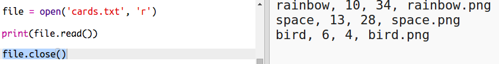

## قراءة بيانات الروبوت من ملف

عادةً، يكون من الأفضل قراءة المعلومات من ملف. ثم يمكنك تغيير البيانات الموجودة في الملف من دون الحاجة إلى تغيير التعليمات البرمجية. 

+ افتح مشروع trinket هذا: <a href="http://jumpto.cc/trumps-go" target="_blank">jumpto.cc/trumps-go</a>. 

+ يتوفر مع مشروع البدء ملف `cards.txt` يحتوي على بيانات عن الروبوتات. 

  انقر على الملف `cards.txt` لرؤية البيانات:

  

  يحتوي كل سطر على بيانات عن أحد الروبوتات. وتفصل الفاصلة بين عناصر البيانات. 

  يحتوي كل سطر على المعلومات التالية:

  الاسم، ودرجة الذكاء، ومدة عمل البطارية، واسم ملف الصورة

+ لنقم بقراءة البيانات من الملف حتى يمكنك استخدامها. 

  أول خطوة هي فتح الملف `cards.txt` في المقطع البرمجي:
  
  
  
+ يمكنك الآن قراءة البيانات من الملف:

  
  
+ يجب أن تُضيف دائمًا التعليمة البرمجية لغلق الملف الذي تنتهي من قراءة بياناته:

  

+ تعطينا هذه التعليمات البرمجية الملفَ كسلسة نصية واحدة، لذا ستحتاج إلى تقسيمه إلى أجزاء بيانات منفصلة. 

  أولًا، يمكنك تقسيم الملف إلى قائمة من الأسطر:

  
  
  انظر جيدًا إلى الإخراج. توجد ثلاثة عناصر في القائمة، ويمثل كل عنصر سطرًا من الملف. 
  
+ يمكنك الآن تكرار الأمر ليشمل هذه الأسطر، سطرًا واحدًا في كل مرة

  
  
+ بدلًا من طباعة هذه الأسطر كما هي، يمكنك الإضافة إلى التعليمات البرمجية لقراءة الأسطر في صورة متغيرات:

  
  
+ ستحتاج إلى إمكانية استخدام هذه البيانات لاحقًا للبحث عن قيم روبوت معين. فلنستخدم اسم الروبوت كمفتاح في قاموس. 

  أضف قاموسًا يُسمى `robots`:

  
  
+ لنضف الآن إدخالًا إلى القاموس `robots` لكل روبوت. 

  سيكون اسم الروبوت هو المفتاح، وستكون القيمة هي قائمة البيانات لهذا الروبوت. 

  أضف التعليمات البرمجية المظللة:
 
  
  
  يمكنك حذف `print robots` بعد أن تختبر المقطع البرمجي. 

