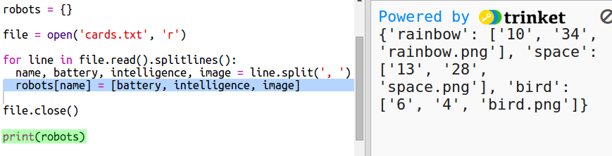

## قراءة بيانات الروبوت من ملف

عادةً، يكون من الأفضل قراءة المعلومات من ملف. ثم يمكنك تغيير البيانات الموجودة في الملف من دون الحاجة إلى تغيير التعليمات البرمجية.

+ افتح مشروع trinket هذا: <a href="http://jumpto.cc/trumps-go" target="_blank">jumpto.cc/trumps-go</a>.

+ يتوفر مع مشروع البدء ملف `cards.txt` يحتوي على بيانات عن الروبوتات.
    
    انقر على الملف `cards.txt` لرؤية البيانات:
    
    
    
    يحتوي كل سطر على بيانات عن أحد الروبوتات. وتفصل الفاصلة بين عناصر البيانات.
    
    يحتوي كل سطر على المعلومات التالية:
    
    name, intelligence rating, how long the battery lasts, image file name

+ Let's read the data in from the file so that you can use it.
    
    The first step is to open the `cards.txt` file in your script:
    
    

+ Now you can read the data from the file:
    
    

+ You should always close a file when you have finished with it:
    
    

+ That gives us the file as one string, you need to break it down into the individual pieces of data.
    
    First, you can split the file into a list of lines:
    
    
    
    Look carefully at the output. There are three items in the list, each one is a line from the file.

+ Now you can loop over those lines one at a time
    
    

+ Instead of printing out the lines, read them in to variables:
    
    

+ You want to be able to use this data later to look up the values for a particular robot. Let's use the robot's name as a key to a dictionary.
    
    Add a `robots` dictionary:
    
    

+ Now let's add an entry to the robots dictionary for each robot.
    
    The name is the key and the value is a list of data for that robot.
    
    Add the highlighted code:
    
    
    
    You can remove `print robots` when you have tested your script.