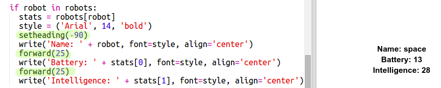

## عرض البيانات

يمكنك الآن عرض بيانات الروبوت بطريقة أجمل. 

لنعرض ورقة روبوت رابحة تحتوي على صورة الروبوت وبيانات عن ذكائه وفائدته. 

بعد أن تُكمل هذه الخطوة، سيمكنك عرض الروبوتات بهذا الشكل:

+ اسأل المستخدم عن الروبوت الذي يريد أن يراه:

  
  
+ إذا كان الروبوت في القاموس، فابحث عن بياناته:

  
  
  اختبر التعليمات البرمجية بإدخال اسم أحد الروبوتات.

  
+ إذا كان الروبوت غير موجود في القاموس، فأدخل تعليمة برمجية لعرض رسالة خطأ:

  
  
 اختبر التعليمة البرمجية بإدخال اسم روبوت غير موجود في القاموس.

+ ستستخدم الآن مكتبة turtle في Python لعرض بيانات الروبوت. 

  قم باستيراد مكتبة turtle أعلى المقطع البرمجي وإعداد الشاشة والسلحفاة:

  

+ أضف الآن التعليمات البرمجية لتطلب من السلحفاة طباعة اسم الروبوت:

  
  
+ جرِّب تغيير المتغير `style` حتى تحصل على الشكل الذي تريده للنص. 
  
  فبدلًا من نوع الخط `Arial`، يمكنك أن تجرِّب: `Courier` أو `Times` أو `Verdana`. 
  
  غيِّر القيمة `14` إلى رقم مختلف لتغيير حجم الخط. 
  
  يمكنك تغيير `bold` إلى `normal` أو `italic`. 
  
+ خزِّن قائمة البيانات الإحصائية للروبوت في متغير بدلًا من طباعتها:

  
  
+ يمكنك الآن الوصول إلى البيانات الإحصائية للروبوت كعناصر في قائمة:

  + `stats[0]` هو عنصر الذكاء
  + `stats[1]` هو عنصر البطارية
  + `stats[2]` هو عنصر اسم الصورة
  
  أضف تعليمات برمجية لعرض البيانات الإحصائية الخاصة بالذكاء والبطارية:
  
  
   
  
+ يوجد خطأ! فكل عناصر البيانات الإحصائية تظهر بعضها فوق بعض. ستحتاج إلى إضافة تعليمات برمجية لتحريك السلحفاة:

   

+ وأخيرًا، لنضف صورة الروبوت ليكتمل العرض. 

  ستحتاج إلى إضافة سطر لتسجيل الصورة عند قراءة البيانات من الملف `cards.txt`:
  
  
     
+ أضف تعليمات برمجية لتحديد موضع الصورة ولصقها:

  
  
+ اختبر التعليمات البرمجية بإدخال اسم روبوت ثم إدخال اسم روبوت آخر. ستجد أن الروبوتين يظهران أحدهما فوق الآخر!

  ستحتاج إلى مسح الشاشة قبل إدخال اسم الروبوت التالي: 

  

