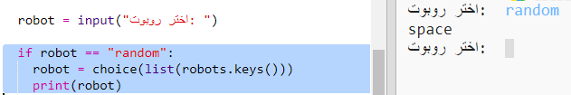

## عرض روبوت عشوائي

لنضِف تعليمة برمجية بحيث تحصل على روبوت عشوائي عندما تكتب Random بدلًا من اسم الروبوت.

+ أولًا، ستحتاج إلى استيراد الدالة `choice` من الوحدة `random`:

  
  
+ يمكنك استخدام `choice` لاختيار اسم روبوت عشوائي من قائمة المفاتيح في القاموس `robot`. 

  
  
+ في Python 3، ستحتاج إلى استخدام `list` لتحويل نتائج `keys` إلى قائمة.

  تلميح: تأكد من كتابة الأقواس بشكل صحيح!

