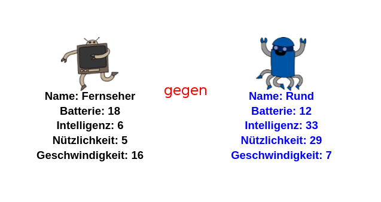

## Einleitung

In diesem Projekt liest du Daten aus einer Datei um Robo-Trumpf Karten zu erstellen. Dann kannst du Robo-Trumpf mit einer Freundin oder einem Freund spielen.

  <iframe src="https://trinket.io/embed/python/9ccc368bd5?outputOnly=true&start=result" width="600" height="500" frameborder="0" marginwidth="0" marginheight="0" allowfullscreen>
  </iframe>
  

### Zusätzliche Informationen für Clubleiter

Falls Sie dieses Projekt ausdrucken müssen, verwenden Sie bitte die [druckfreundliche Version](https://projects.raspberrypi.org/en/projects/robo-trumps/print).

## \--- collapse \---

## title: Anmerkungen für Clubleiter

## Einleitung:

In diesem Projekt lesen die Lernenden Daten aus einer Datei in eine Wörterbuch-Datenstruktur (dictionary) um Robo-Trumpf Karten zu erstellen. Diese Karten können dann benutzt werden um mit einer Freundin oder einem Freund Robo-Trumpf zu spielen.

## Online-Ressourcen

**Dieses Projekt verwendet Python 3.** Wir empfehlen die Verwendung von [trinket](https://trinket.io/), um Python-Programme online zu schreiben. Dieses Projekt enthält die folgenden Trinkets:

* ['Robotrumpf' Ausgangspunkt - jumpto.cc/trumps-go](http://jumpto.cc/trumps-go)

Es gibt auch ein Trinket mit einer Beispiellösung für die zusätzlichen Aufgaben:

* ['Robotrumpf' fertiggestellt - trinket.io/python/9ccc368bd5](https://trinket.io/python/9ccc368bd5)

## Offline-Ressourcen

Dieses Projekt kann, falls gewünscht, auch [offline bearbeitet](https://www.codeclubprojects.org/en-GB/resources/python-working-offline/) werden. Sie können auf die Projektressourcen zugreifen, indem Sie auf den Link "Projektmaterial" für dieses Projekt klicken. Dieser Link enthält einen Abschnitt "Projektressourcen" mit Ressourcen, die die Kinder benötigen, um das Projekt offline abschließen zu können. Stellen Sie sicher, dass jedes Kind Zugriff auf eine Kopie dieser Ressourcen hat. Dieser Abschnitt enthält die folgenden Dateien:

* robotrumps/robotrumps.py
* robotrumps/cards.txt
* einige .gif-Bilder von Robotern

Eine vollständige Version dieses Projekts finden Sie auch im Abschnitt "Ressourcen für Freiwillige". Diese enthält:

* robotrumps-finished/robotrumps.py
* robotrumps-finished/cards.txt
* einige .gif-Bilder von Robotern

(Alle oben genannten Ressourcen können auch als `.zip`-Dateien für Projekte und für Freiwillige heruntergeladen werden.)

## Lernziele

* Vertiefung: Datenstrukturen, Lesen aus Dateien und Turtle-Grafik;
* Verwenden von Bildern in Turtle-Grafiken;
* Teilen von Trinket-Projekten.

Dieses Projekt umfasst Elemente aus den folgenden Zweigen des [Raspberry Pi Digital Making Curriculum](http://rpf.io/curriculum):

* [Verschiedene Programmierkonstrukte kombinieren um ein Problem zu lösen.](https://www.raspberrypi.org/curriculum/programming/builder)

## Herausforderungen

* Hinzufügen weiterer Roboter - Bearbeiten einer .txt-Datei und Arbeiten mit Bildern;
* Hinzufügen weiterer Daten zu den Robotern - Umgang mit Daten;
* Spiele Robotrumpf mit einem Freund.

## Häufig Gestellte Fragen

* **Offline-Python funktioniert nicht mit .png-Bildern. Für die Offline-Verwendung wurden .gif Bilder bereitgestellt.**
* Beachten Sie, dass dieses Projekt sowohl Texteingaben als auchTutle-grafiken verwendet. Sie können den Platz anpassen, der jedem Teil in Trinket zugewiesen wird.
* Sie müssen vor dem Eingeben in das Trinket-Textfenster klicken.
* Kinder können die Option "Teilen" in Trinket verwenden, um einen Link zu ihrem Projekt zu erhalten. Wenn sie Zugriff auf E-Mails haben, können sie den Link per E-Mail an einen Freund oder eine Freundin senden, andernfalls können sie ihn einfach ablesen, auf einem Blatt Papier notieren oder in einer Textdatei im lokalen Netzwerk speichern.

\--- /collapse \---

## \--- collapse \---

## title: Projektmaterial

## Projektressourcen

* [.zip-Datei, die alle Projektressourcen enthält](resources/robo-trumps-project-resources.zip)
* [Online Trinket mit allen Ressourcen des 'Robo Trumpf'-Projekts](http://jumpto.cc/trumps-go)
* [robo-trumps/robo-trumps.py](resources/robo-trumps-robo-trumps.py)
* [robo-trumps/cards.txt](resources/robo-trumps-cards.txt)
* [robo-trumps/space.gif](resources/robo-trumps-space.gif)
* [robo-trumps/rainbow.gif](resources/robo-trumps-rainbow.gif)
* [robo-trumps/bird.gif](resources/robo-trumps-bird.gif)
* [robo-trumps/dog.gif](resources/robo-trumps-dog.gif)
* [robo-trumps/jet.gif](resources/robo-trumps-jet.gif)
* [robo-trumps/round.gif](resources/robo-trumps-round.gif)
* [robo-trumps/brains.gif](resources/robo-trumps-brains.gif)
* [robo-trumps/twoheads.gif](resources/robo-trumps-twoheads.gif)
* [robo-trumps/shades.gif](resources/robo-trumps-shades.gif)
* [robo-trumps/hair.gif](resources/robo-trumps-hair.gif)
* [robo-trumps/tv.gif](resources/robo-trumps-tv.gif)
* [robo-trumps/yellow.gif](resources/robo-trumps-yellow.gif)

## Ressourcen für Clubleiter

* [.zip-Datei, die alle fertig gestellten Projektressourcen enthält](resources/robotrumps-volunteer-resources.zip)
* [Vollständiges Trinket-Projekt (online)](https://trinket.io/python/9ccc368bd5)
* [robo-trumps-finished/robo-trumps.py](resources/robo-trumps-finished-robo-trumps.py)
* [robo-trumps-finished/cards.txt](resources/robo-trumps-finished-cards.txt)
* [robo-trumps-finished/space.gif](resources/robo-trumps-finished-space.gif)
* [robo-trumps-finished/rainbow.gif](resources/robo-trumps-finished-rainbow.gif)
* [robo-trumps-finished/bird.gif](resources/robo-trumps-finished-bird.gif)
* [robo-trumps-finished/dog.gif](resources/robo-trumps-finished-dog.gif)
* [robo-trumps-finished/jet.gif](resources/robo-trumps-finished-jet.gif)
* [robo-trumps-finished/round.gif](resources/robo-trumps-finished-round.gif)
* [robo-trumps-finished/brains.gif](resources/robo-trumps-finished-brains.gif)
* [robo-trumps-finished/twoheads.gif](resources/robo-trumps-finished-twoheads.gif)
* [robo-trumps-finished/shades.gif](resources/robo-trumps-finished-shades.gif)
* [robo-trumps-finished/hair.gif](resources/robo-trumps-finished-hair.gif)
* [robo-trumps-finished/tv.gif](resources/robo-trumps-finished-tv.gif)
* [robo-trumps-finished/yellow.gif](resources/robo-trumps-finished-yellow.gif)

\--- /collapse \---