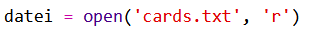
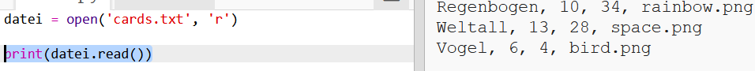
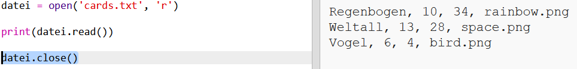

## Lies die Roboter Daten aus einer Datei ab

Es ist oft sehr hilfreich, wenn man Informationen aus einer Datei ablesen kann. Du kannst dann die Daten in der Datei ändern, ohne deinen Code ändern zu müssen. 

+ Dieses Trinket öffnen: <a href="http://jumpto.cc/trumps-go" target="_blank">jumpto.cc/trumps-go</a>. 

+ Dein Starter-Projekt beinhaltet eine Datei namens `cards.txt`, welche Daten über die Roboter enthält. 

  Klicke auf `cards.txt`, um diese Daten sehen zu können:

  

  Jede Zeile beinhaltet Daten über einen Roboter. Die Datenposten werden durch ein Komma getrennt. 

  Jede Zeile enthält die folgenden Informationen:

  Name, Intelligenzpunktzahl, wie lange die Batterie geladen bleibt, Bilddateiname

+ Lass uns die Daten von der Datei einlesen, damit wir sie benutzen können. 

  Der erste Schritt ist, die `cards.txt` Datei in deinem Script zu öffnen:
  
  
  
+ Jetzt kannst du die Daten von der Datei ablesen:

  
  
+ Wenn du damit fertig bist, solltest du die benutzte Datei immer sofort schließen:

  

+ Dies zeigt uns die Datei als eine Zeichenkette, du musst sie in die einzelnen Datenstücke aufteilen. 

  Als erstes kannst du die Datei in eine Liste von Zeilen teilen:

  
  
  Achte sorgfältig auf die Ausgabe. Es gibt drei Posten in der Liste, jeder davon ist eine Zeile aus der Datei. 
  
+ Jetzt kannst du, eins nach dem anderen, eine Schleife über diese Zeilen ziehen

  
  
+ Anstatt die Zeilen auszudrucken, kannst du sie in Variable lesen:

  
  
+ Du willst in der Lage sein, diese Daten zu einem späteren Zeitpunkt zu benutzen, um die Werte für einen bestimmten Roboter nachschlagen zu können. Lass uns den Namen des Roboters als Schlüssel für ein Wörterbuch benutzen. 

  Füge ein `robots` (Roboter) Wörterbuch hinzu:

  
  
+ Lass uns jetzt einen Eintrag für jeden einzelnen Roboter in das Roboter-Wörterbuch hinzufügen. 

  Der Name ist der Schlüssel und der Wert ist eine Liste an Daten für diesen Roboter. 

  Füge den markierten Code hinzu:
 
  
  
  Du kannst `print robots` (Roboter drucken) entfernen, nachdem du dein Script getestet hast. 
