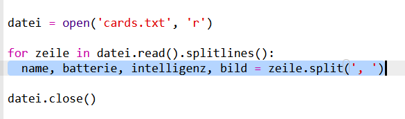

## Lies die Roboter Daten aus einer Datei

Es ist oft nützlich, Informationen aus einer Datei lesen zu können. Du kannst dann die Daten in der Datei ändern, ohne deinen Code ändern zu müssen.

+ Öffne diesen Trinket: <a href="http://jumpto.cc/trumps-go" target="_blank">jumpto.cc/trumps-go</a>.

+ Dein Starterprojekt enthält eine Datei namens `cards.txt`, die Daten zu Robotern enthält.
    
    Klicke auf den Reiter `cards.txt` um die Daten zu sehen:
    
    
    
    Jede Zeile enthält Daten über einen Roboter. Die Datenelemente sind durch Kommas getrennt.
    
    Jede Zeile enthält folgende Informationen:
    
    Name, Intelligenzbewertung, Lebensdauer der Batterie, Dateiname des Bildes

+ Lass uns die Daten aus der Datei lesen, damit du sie verwenden kannst.
    
    Der erste Schritt ist das Öffnen der Datei `cards.txt` in deinem Skript:
    
    

+ Jetzt kannst du die Daten aus der Datei lesen:
    
    

+ Du solltest eine Datei immer schließen, wenn du damit fertig bist:
    
    

+ Damit erhalten wir den ganzen Inhalt der Datei als eine Zeichenfolge. Du musst sie in die einzelnen Datenelemente aufteilen.
    
    Zunächst kannst du die Datei in eine Liste von Zeilen aufteilen:
    
    
    
    Sieh dir die Ausgabe genau an. Es gibt drei Elemente in der Liste, in denen sich jeweils eine Zeile aus der Datei befindet.

+ Jetzt kannst du diese Zeilen mit einer Schleife durchlaufen
    
    

+ Statt die Zeilen auszudrucken, lies sie in Variablen ein:
    
    

+ Du möchtest diese Daten später verwenden können, um die Werte für einen bestimmten Roboter abzurufen. Verwenden wir den Namen des Roboters als Schlüssel zu einem dictionary (englisch für Wörterbuch).
    
    Füge ein dictionary namens `roboter` hinzu:
    
    

+ Jetzt fügen wir einen Eintrag zum Roboter-dictionary für jeden Roboter hinzu.
    
    Der Name ist der Schlüssel und der Wert ist eine Liste von Daten für diesen Roboter.
    
    Füge den markierten Code hinzu:
    
    
    
    Du kannst `print roboter` entfernen, wenn du dein Skript getestet hast.