## Daten anzeigen

Jetzt kannst du die Roboter Daten auf interessantere Art darstellen. 

Lass uns eine Roboter Trump-Karte mit einem Bild sowie den Daten für dessen Intelligenz und Nützlichkeit darstellen. 

Wenn du diesen Schritt beendet hast, wirst du in der Lage sein, die Roboter wie folgt anzuzeigen:

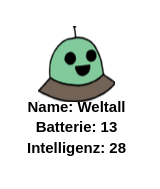

+ Frage deinen Mitspieler, welchen Roboter er/sie sehen möchte:

  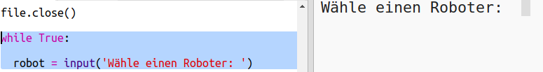
  
+ Wenn der Roboter im Wörterbuch ist, suche dann die Daten hierfür:

  
  
  Teste deinen Code, indem du den Namen des Roboters eingibst.

  
+ Falls der Roboter nicht existiert,dann gib eine Fehlermeldung:

  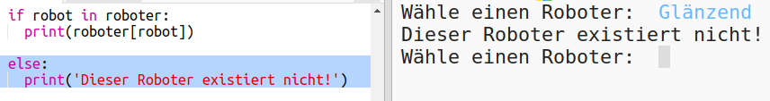
  
 Teste deinen Code, indem du einen Roboternamen eingibst, der nicht im Wörterbuch ist.

+ Jetzt wirst du die Python Schildkröte benutzen, um die Roboter-Daten anzuzeigen. 

  Importiere die Turtle-Bibliothek über deinem Script und richte den Bildschirm und die Schildkröte ein:

  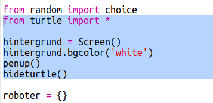

+ Jetzt kannst du den Code hinzufügen, damit die Schildkröte den Namen des Roboters druckt:

  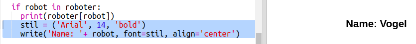
  
+ Probiere mal die `style` (Stil) Variable zu ändern bis du mit dem Text zufrieden bist. 
  
  Anstatt `Arial` zu benutzen, könntest du eine dieser Schriftarten ausprobieren: `Courier`, `Times` oder `Verdana`. 
  
  Ändere die Schriftgröße von `14` zu einer anderen Größenzahl. 
  
  Du kannst von `bold` (fett) zu `normal` oder `italic` (kursiv) gehen. 
  
+ Speichere die Liste der Statistiken für den Roboter in einer Variable, anstatt sie auszudrucken:

  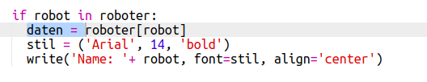
  
+ Du hast jetzt Zugriff auf die Statistiken für den Roboter, die als Posten in einer Liste dargestellt werden:

  + `stats[0]` (Statistik 0) ist die Intelligenz
  + `stats[1]` (Statistik 1) ist die Batterie
  + `stats[2]` (Statistik 2) ist der Bildname
  
  Füge den Code hinzu, um die Statistiken für die Intelligenz und die Batterie anzuzeigen:
  
  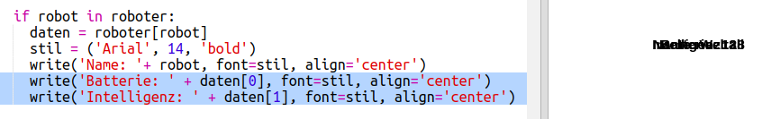
   
  
+ Ach herrje! Die Statistiken liegen alle übereinander! Du musst noch mehr Code hinzufügen, um die Schildkröte zu bewegen:

   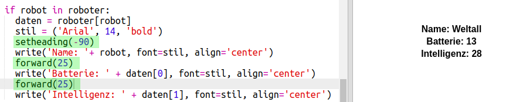

+ Und zum Schluss, lass uns das Roboterbild hinzufügen, um die Darstellung zu vollenden. 

  Du wirst eine weitere Zeile hinzufügen müssen, um das Bild zu registrieren, wenn du die Daten von `cards.txt` abliest:
  
  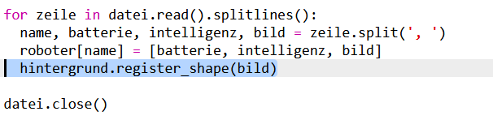
     
+ Füge dann noch weiteren Code hinzu, um das Bild zu stempeln und zu positionieren:

  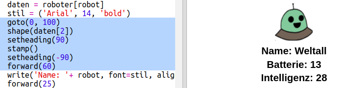
  
+ Teste deinen Code, indem du erst einen Roboter und dann einen weiteren eingibst. Du wirst dann sehen, dass sie übereinander liegen!

  Du musst den Bildschirm leeren, ehe du den Roboter darstellst: 

  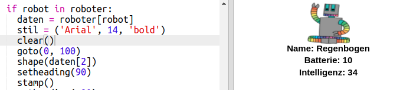
