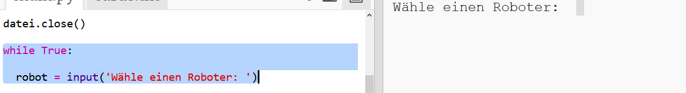
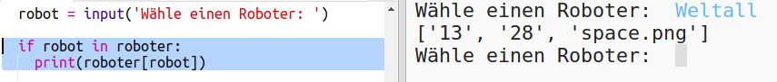

## Daten anzeigen

Jetzt kannst du die Roboterdaten auf eine interessantere Weise anzeigen.

Lass uns eine Robotertrumpfkarte mit einem Bild und Daten für ihre Intelligenz und Nützlichkeit anzeigen.

Wenn du diesen Schritt abgeschlossen hast, kannst du Roboter wie folgt anzeigen:

+ Frage den Benutzer, welchen Roboter er sehen möchte:
    
    

+ Wenn sich der Roboter im dictionary befindet, suche seine Daten:
    
    
    
    Teste deinen Code, indem du einen Roboternamen eingibst.

+ Wenn der Roboter nicht existiert, gib eine Fehlermeldung aus:
    
    
    
    Teste deinen Code, indem du einen Roboternamen eingibst, der nicht im dictionary enthalten ist.

+ Jetzt wirst du die Python-turtle (englisch für Schildkröte) verwenden, um die Roboterdaten anzuzeigen.
    
    Importiere die turtle-Bibliothek oben in deinem Skript und richte den Hintergrund (das Fenser in der die Grafik angezeigt wird) und die Turtle ein:
    
    

+ Füge nun Code hinzu, damit die Turtle den Namen des Roboters ausdrucken kann:
    
    

+ Ändere die Variable `stil`, bis du mit dem Text zufrieden bist.
    
    Versuche anstelle von `Arial`: `Courier`, `Times` oder `Verdana`.
    
    Ändere `14` auf eine andere Zahl, um die Schriftgröße zu ändern.
    
    Du kannst auch `bold` zu `normal` oder `italic` ändern.

+ Speichere die Liste der Roboterdaten in einer Variablen, anstatt sie auszudrucken:
    
    

+ Jetzt kannst du auf die Roboterdaten als Elemente in einer Liste zugreifen:
    
    + `daten[0]` ist Intelligenz
    + `daten[1]` ist Batterie
    + `daten[2]` ist der Bildname
    
    Füge Code hinzu, um die Intelligenz- und Batteriestatistiken anzuzeigen:
    
    

+ Oh je! Die Daten liegen alle übereinander. Du musst Code hinzufügen, um die Turtle zu bewegen:
    
    

+ Und schließlich fügen wir das Roboterbild hinzu, um die Anzeige abzuschließen.
    
    Du musst eine Zeile hinzufügen, um das Bild zu registrieren, wenn du die Daten aus `cards.txt` liest:
    
    

+ Füge nun noch Code hinzu, um das Bild zu positionieren und zu stempeln:
    
    

+ Teste deinen Code, indem du einen Roboter und dann einen anderen eingibst. Du wirst sehen, dass sie übereinander angezeigt werden!
    
    Du musst den Bildschirm löschen, bevor du einen Roboter anzeigen kannst:
    
    