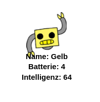

\--- challenge \---

## Aufgabe: Füge noch mehr Roboter hinzu

Kannst du Daten über mehr Robotern zu `cards.txt` hinzufügen.

Klicke auf die Schaltfläche Bilder, um die Roboterbilder anzuzeigen, die du verwenden kannst.

Du kannst entscheiden, wie viel Batterie und Intelligenz sie haben.

\--- /challenge \---