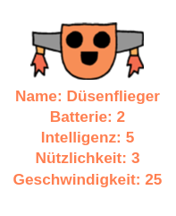

\--- challenge \---

## Aufgabe: Füge den Robotern weitere Daten hinzu

Kannst du dir weitere Daten vorstellen, die du zu den Robotern hinzufügen könntest? Du könntest 'Geschwindigkeit' oder 'Nützlichkeit' hinzufügen oder eigene Ideen entwickeln.

Du musst:

+ Der Datei für jede neue Kategorie Daten hinzufügen 
+ Die neue Kategorie den Code hinzufügen, der die Daten einliest
+ Die neue Kategorie anzeigen, wenn du eine Trumpfkarte anzeigst

Du könntest sogar eine Farbe hinzufügen und die Daten für Roboter in ihrer eigenen Farbe anzeigen.

Hinweis: Verwende `color('red')` um den Text der Turtle vor dem Schreiben auf Rot zu ändern.

Beispiel:

\--- /challenge \---