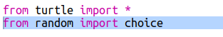
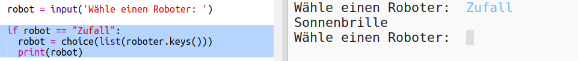

## Einen zufällig gewählten Roboter darstellen

Füge jetzt Code hinzu, damit du einen zufällig gewählten Roboter erhältst, wenn du anstelle eines Roboternamens "Zufall" eingibst.

+ Zuerst musst du die Auswahlfunktion aus dem Zufallsmodul importieren:
    
    

+ Du kannst die Option `choice` verwenden um einen zufälligen Roboternamen aus der Liste der Schlüssel aus dem Roboter-dictionary auszuwählen.
    
    

+ In Python 3 müssen Sie `list` verwenden um aus den Ergebnissen des Befehls `keys` eine Liste zu machen.
    
    Tipp: Überprüfen Sie Ihre Klammern sorgfältig!