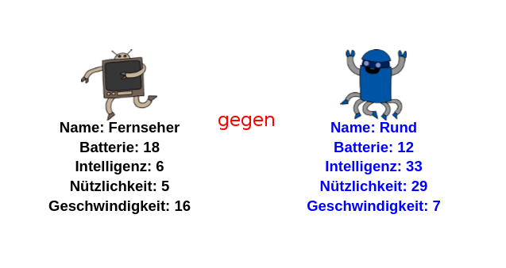

--- challenge ---
## Aufgabe: Spiele Robot-Trumps mit einem Freund/einer Freundin 

Teile dein Projekt mit einem Freund/einer Freundin und spiele Robo-Trumps. Beide Spieler benutzen das gleiche Projekt, damit es fair ist! Der Spieler Nummer 1 wählt einen zufällig ausgesuchten Roboter und wählt dann eine Kategorie. Der Spieler Nummer 2 wählt dann einen zufällig ausgesuchten Roboter und ihr prüft, wer die höchste Punktzahl für die angesagte Kategorie hat, dann tauscht ihr, wer als Nächstes dran ist. 

Das Spiel funktioniert am besten, wenn beide Spieler mit dem gleichen Kartenset spielen. Teile einen Link zu deinem Trinket-Projekt mit einem Freund/einer Freundin, damit ihr beide das gleiche Kartenset benutzen könnt. 

--- /challenge ---