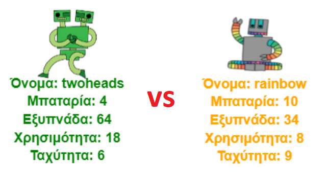

## Εισαγωγή

Σε αυτό το έργο θα διαβάσεις δεδομένα από ένα αρχείο για να δημιουργήσεις κάρτες για ρομπότ. Στη συνέχεια μπορείς να παίξεις Ρομπο-Κάρτες με έναν φίλο.

  <iframe src="https://trinket.io/embed/python/2f83eb52a5?outputOnly=true&start=result" width="600" height="500" frameborder="0" marginwidth="0" marginheight="0" allowfullscreen>
  </iframe>
  

### Πρόσθετες πληροφορίες για τους συντονιστές των ομάδων

Αν χρειαστεί να εκτυπώσεις αυτό το έργο, χρησιμοποίησε την [εκτυπώσιμη έκδοση](https://projects.raspberrypi.org/el-GR/projects/robo-trumps/print).

--- collapse ---
---
title: Σημειώσεις συντονιστή ομάδας
---
## Εισαγωγή:

Σε αυτό το πρόγραμμα οι εκπαιδευόμενοι θα μεταφέρουν τα δεδομένα από ένα αρχείο σε ένα λεξικό, για να δημιουργήσουν κάρτες για ρομπότ. Οι Ρομπο-Κάρτες μπορούν στη συνέχεια να χρησιμοποιηθούν για να παίξουν με έναν φίλο.

## Online Πόροι

**Αυτό το πρόγραμμα χρησιμοποιεί Python 3.** Συνιστούμε να χρησιμοποιήσεις [trinket](https://trinket.io/) για να γράψεις Python online. Το έργο αυτό περιλαμβάνει τα ακόλουθα Trinkets:

* ['Ρομπο-Κάρτες' αρχικό -- trinket.io/python/a3bd5bccd3](http://trinket.io/python/a3bd5bccd3)

Υπάρχει επίσης ένα trinket που περιέχει ένα υπόδειγμα λύσης στις προκλήσεις:

* ['Ρομπο-Κάρτες' ολοκληρωμένο - trinket.io/python/2f83eb52a5](https://trinket.io/python/2f83eb52a5)

## Offline Πόροι

Το έργο αυτό μπορεί να [ολοκληρωθεί χωρίς σύνδεση](https://www.codeclubprojects.org/en-GB/resources/python-working-offline/) αν προτιμάς. Μπορείς να αποκτήσεις πρόσβαση στους πόρους του έργου κάνοντας κλικ στο σύνδεσμο «Υλικό έργου» για αυτό το έργο. Αυτός ο σύνδεσμος περιέχει μια ενότητα "Πόροι έργου", η οποία περιλαμβάνει πόρους που τα παιδιά θα χρειαστούν για να ολοκληρώσουν το έργο αυτό εκτός σύνδεσης. Βεβαιώσου ότι κάθε παιδί έχει πρόσβαση σε ένα αντίγραφο αυτών των πόρων. Αυτή η ενότητα περιλαμβάνει τα ακόλουθα αρχεία:

* robotrumps/robotrumps.py
* robotrumps/cards.txt
* Διάφορες εικόνες .gif ρομπότ

Μπορείς επίσης να βρεις μια ολοκληρωμένη έκδοση αυτού του έργου στην ενότητα 'Πόροι Εθελοντών', η οποία περιέχει:

* robotrumps-finished/robotrumps.py
* robotrumps-finished/cards.txt
* Διάφορες εικόνες .gif ρομπότ

(Όλοι οι παραπάνω πόροι μπορούν επίσης να κατέβουν ως συμπιεσμένα `.zip` αρχεία.)

## Στόχοι μάθησης

* Ενοποίηση: δομές δεδομένων, ανάγνωση από αρχεία και γραφικά χελώνας (turtle).
* Χρήση εικόνων σε γραφικά χελώνας (turtle).
* Κοινή χρήση έργων trinket.

Αυτό το έργο καλύπτει στοιχεία από τις ακόλουθες πτυχές του [Προγράμματος Μαθημάτων Ψηφιακής Δημιουργίας του Raspberry Pi](http://rpf.io/curriculum):

* [Συνδύασε δομές προγραμματισμού για να λύσεις ένα πρόβλημα.](https://www.raspberrypi.org/curriculum/programming/builder)

## Προκλήσεις

* Πρόσθεσε περισσότερα ρομπότ - Επεξεργασία αρχείου .txt και εργασία με εικόνες.
* Πρόσθεσε περισσότερα στατιστικά στοιχεία στα ρομπότ - χειρισμός δεδομένων.
* Παίξε Ρομπο-Κάρτες με έναν φίλο.

## Συχνές Ερωτήσεις

* **Η offline Python δεν υποστηρίζει εικόνες .png. Οι εικόνες .gif παρέχονται για χρήση εκτός σύνδεσης.**
* Λάβε υπόψη ότι το έργο αυτό χρησιμοποιεί ως είσοδο τόσο κείμενο όσο και γραφικά χελώνας (turtle), και ότι μπορείς στο trinket να ρυθμίσεις το μέγεθος του χώρου που δίνεται σε κάθε ένα από αυτά.
* Θα χρειαστεί να κάνεις κλικ στο παράθυρο κειμένου του trinket πριν πληκτρολογήσεις.
* Τα παιδιά μπορούν να χρησιμοποιήσουν την επιλογή "Share" στο trinket για να αποκτήσουν ένα σύνδεσμο για το έργο τους. Εάν έχουν πρόσβαση στο ηλεκτρονικό ταχυδρομείο τότε μπορούν να στείλουν το σύνδεσμο σε έναν φίλο, αλλιώς μπορούν απλά να το διαβάσουν, να το σημειώσουν σε ένα κομμάτι χαρτί ή να το αποθηκεύσουν σε ένα αρχείο κειμένου στο τοπικό δίκτυο.

--- /collapse ---

--- collapse ---
---
title: Υλικό έργου
---
## Πόροι έργου

* [αρχείο .zip που περιέχει όλους τους πόρους του έργου](resources/robo-trumps-project-resources.zip)
* [Online Trinket που περιέχει τους αρχικούς πόρους για το έργο "Ρομπό-Κάρτες"](http://trinket.io/python/a3bd5bccd3)
* [robo-trumps/robo-trumps.py](resources/robo-trumps-robo-trumps.py)
* [robo-trumps/cards.txt](resources/robo-trumps-cards.txt)
* [robo-trumps/space.gif](resources/robo-trumps-space.gif)
* [robo-trumps/rainbow.gif](resources/robo-trumps-rainbow.gif)
* [robo-trumps/bird.gif](resources/robo-trumps-bird.gif)
* [robo-trumps/dog.gif](resources/robo-trumps-dog.gif)
* [robo-trumps/jet.gif](resources/robo-trumps-jet.gif)
* [robo-trumps/round.gif](resources/robo-trumps-round.gif)
* [robo-trumps/brains.gif](resources/robo-trumps-brains.gif)
* [robo-trumps/twoheads.gif](resources/robo-trumps-twoheads.gif)
* [robo-trumps/shades.gif](resources/robo-trumps-shades.gif)
* [robo-trumps/hair.gif](resources/robo-trumps-hair.gif)
* [robo-trumps/tv.gif](resources/robo-trumps-tv.gif)
* [robo-trumps/yellow.gif](resources/robo-trumps-yellow.gif)

## Πόροι συντονιστή ομάδας

* [Αρχείο .zip που περιέχει όλους τους πόρους του ολοκληρωμένου έργου](resources/robotrumps-volunteer-resources.zip)
* [Online ολοκληρωμένο έργο Trinket](https://trinket.io/python/2f83eb52a5)
* [robo-trumps-finished/robo-trumps.py](resources/robo-trumps-finished-robo-trumps.py)
* [robo-trumps-finished/cards.txt](resources/robo-trumps-finished-cards.txt)
* [robo-trumps-finished/space.gif](resources/robo-trumps-finished-space.gif)
* [robo-trumps-finished/rainbow.gif](resources/robo-trumps-finished-rainbow.gif)
* [robo-trumps-finished/bird.gif](resources/robo-trumps-finished-bird.gif)
* [robo-trumps-finished/dog.gif](resources/robo-trumps-finished-dog.gif)
* [robo-trumps-finished/jet.gif](resources/robo-trumps-finished-jet.gif)
* [robo-trumps-finished/round.gif](resources/robo-trumps-finished-round.gif)
* [robo-trumps-finished/brains.gif](resources/robo-trumps-finished-brains.gif)
* [robo-trumps-finished/twoheads.gif](resources/robo-trumps-finished-twoheads.gif)
* [robo-trumps-finished/shades.gif](resources/robo-trumps-finished-shades.gif)
* [robo-trumps-finished/hair.gif](resources/robo-trumps-finished-hair.gif)
* [robo-trumps-finished/tv.gif](resources/robo-trumps-finished-tv.gif)
* [robo-trumps-finished/yellow.gif](resources/robo-trumps-finished-yellow.gif)

--- /collapse ---