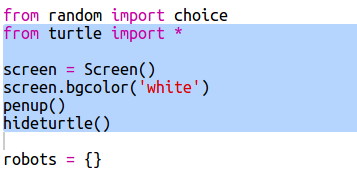

## Εμφάνιση των δεδομένων

Τώρα μπορείς να εμφανίσεις τα στοιχεία των ρομπότ με έναν πιο ενδιαφέροντα τρόπο.

Ας εμφανίσουμε μια ρομπο-κάρτα με μια εικόνα και πληροφορίες για τη νοημοσύνη και τη χρησιμότητά της.

Όταν ολοκληρώσεις αυτό το βήμα, θα μπορείς να εμφανίσεις τέτοια ρομπότ:

+ Ρώτησε το χρήστη ποιο ρομπότ θα ήθελε να δει:
    
    

+ Εάν το ρομπότ υπάρχει στο λεξικό, αναζήτησε τα στοιχεία του:
    
    
    
    Δοκίμασε τον κώδικά σου εισάγοντας ένα όνομα ρομπότ.

+ Αν το ρομπότ δεν υπάρχει, εμφάνισε μήνυμα σφάλματος:
    
    
    
    Δοκίμασε τον κώδικα εισάγοντας ένα όνομα ρομπότ που δεν υπάρχει στο λεξικό.

+ Τώρα θα χρησιμοποιήσεις τη βιβλιοθήκη "turtle" της Python για να εμφανίσεις τα στοιχεία του ρομπότ.
    
    Εισήγαγε τη βιβλιοθήκη "turtle" στην αρχή του σεναρίου και ρύθμισε τα εργαλεία σχεδίασης:
    
    

+ Τώρα πρόσθεσε κώδικα για να εκτυπώσεις το όνομα του ρομπότ:
    
    

+ Δοκίμασε να αλλάξεις τη μεταβλητή `style` μέχρι να σου αρέσει το αποτέλεσμα.
    
    Αντί του `Arial` θα μπορούσες να δοκιμάσεις: `Courier`, `Times` ή `Verdana`.
    
    Άλλαξε το `14` σε διαφορετικό αριθμό για το μέγεθος της γραμματοσειράς.
    
    Μπορείς να αλλάξεις το `bold` σε `normal` ή `italic`.

+ Αποθήκευσε τη λίστα στατιστικών στοιχείων για το ρομπότ σε μια μεταβλητή αντί να τα εμφανίσεις:
    
    

+ Τώρα μπορείς να αποκτήσεις πρόσβαση στα στατιστικά στοιχεία του ρομπότ ως στοιχεία μίας λίστας:
    
    + `stats[0]` είναι η νοημοσύνη
    + `stats[1]` είναι η μπαταρία
    + `stats[2]` είναι το όνομα της εικόνας
    
    Πρόσθεσε κώδικα για να εμφανίσεις τα στατιστικά στοιχεία νοημοσύνης και μπαταρίας:
    
    

+ Ωχ! Τα στατιστικά στοιχεία επικαλύπτονται. Θα χρειαστεί να προσθέσεις κώδικα για να μετακινείς τη χελώνα γραφικών:
    
    

+ Και τέλος, ας προσθέσουμε την εικόνα του ρομπότ για να ολοκληρώσουμε την εμφάνιση.
    
    Θα χρειαστεί να προσθέσεις μια γραμμή για την καταχώρηση της εικόνας όταν διαβάζεις τα στοιχεία από το `cards.txt`:
    
    

+ Και πρόσθεσε κώδικα για να τοποθετήσεις και να σφραγίσεις την εικόνα:
    
    

+ Δοκίμασε τον κώδικα εισάγοντας ένα ρομπότ και έπειτα ένα άλλο και θα δεις ότι εμφανίζονται το ένα πάνω στο άλλο!
    
    Πρέπει να καθαρίσεις την οθόνη πριν εμφανίσεις ένα ρομπότ:
    
    