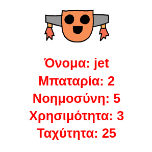

\--- challenge \---

## Πρόκληση: Πρόσθεσε περισσότερα στοιχεία για τα ρομπότ

Μπορείς να σκεφτείς περισσότερα στοιχεία για να προσθέσεις στα ρομπότ. Μπορείς να προσθέσεις 'ταχύτητα' ή 'χρησιμότητα' ή ό,τι άλλο σκεφτείς.

Θα χρειαστεί:

+ Να προσθέσεις δεδομένα στο αρχείο για κάθε νέα κατηγορία 
+ Να προσθέσεις τη νέα κατηγορία στον κώδικα που διαβάζει τα δεδομένα
+ Να γράψεις τη νέα κατηγορία όταν εμφανίζεται μια ρομπο-κάρτα

Θα μπορούσες ακόμη να προσθέσεις ένα χρώμα και να δεις τα στατιστικά στοιχεία για τα ρομπότ στο δικό τους χρώμα.

Συμβουλή: Χρησιμοποίησε την εντολή `color('red')` για να αλλάξεις το χρώμα κειμένου σε κόκκινο πριν γράψεις.

Για παράδειγμα:

\--- /challenge \---