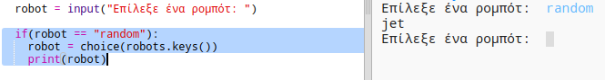

## Εμφάνισε ένα τυχαίο ρομπότ

Ας προσθέσουμε κώδικα έτσι ώστε να εμφανίζεται ένα τυχαίο ρομπότ όταν πληκτρολογείς Random αντί για ένα όνομα ρομπότ.

+ Πρώτα θα πρέπει να εισάγεις τη συνάρτηση "choice" από τη βιβλιοθήκη "random":
    
    

+ Μπορείς να χρησιμοποιήσεις την `choice` για να επιλέξεις ένα τυχαίο όνομα ρομπότ από τη λίστα κλειδιών του λεξικού robots.
    
    

+ Στην Python 3 θα πρέπει να χρησιμοποιήσεις τη συνάρτηση `list` για να μετατρέψεις τα αποτελέσματα της εντολής `keys` σε μια λίστα.
    
    Συμβουλή: Βεβαιώσου ότι χρησιμοποιείς σωστά τις παρενθέσεις!