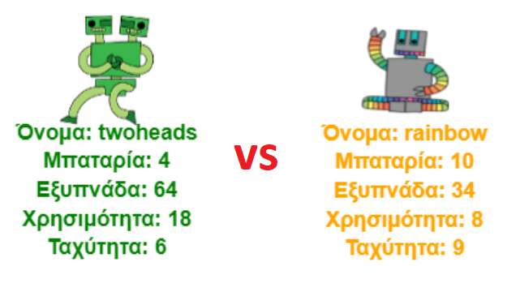

--- challenge ---

## Πρόκληση: Παίξε ρομπο-κάρτες με έναν φίλο

Μοιράσου το έργο σου με έναν φίλο και παίξτε Ρομπο-Κάρτες. Χρησιμοποιήστε και οι δύο το ίδιο έργο έτσι ώστε να είναι δίκαιο! Ο πρώτος παίκτης εμφανίζει ένα τυχαίο ρομπότ και στη συνέχεια επιλέγει μία κατηγορία. Ο δεύτερος παίκτης στη συνέχεια εμφανίζει ένα τυχαίο ρομπότ. Ελέγχετε ποιος έχει το υψηλότερο σκορ για την επιλεγμένη κατηγορία και, στη συνέχεια, παίζετε ανάποδα.

Το παιχνίδι λειτουργεί καλύτερα αν και οι δύο παίζετε με το ίδιο σετ από ρομπότ. Μπορείς να δώσεις ένα σύνδεσμο του έργου σου στο trinket σε έναν φίλο, ώστε να μπορείτε να χρησιμοποιήσετε και οι δύο το ίδιο σετ.

--- /challenge ---

### Κοινοτική συνεισφορά μετάφρασης

Το έργο αυτό μεταφράστηκε από Μάνος Ζεάκης και αναθεωρήθηκε από Γιώργος Νικολαΐδης. 

Οι εκπληκτικοί μας εθελοντές-μεταφραστές μας βοηθούν να δώσουμε στα παιδιά όλου του κόσμου την ευκαιρία να μάθουν να προγραμματίζουν. Μπορείτε να μας βοηθήσετε να προσεγγίσουμε περισσότερα παιδιά μεταφράζοντας τα έργα μας - διαβάστε περισσότερα στο [rpf.io/translators](https://rpf.io/translators).
