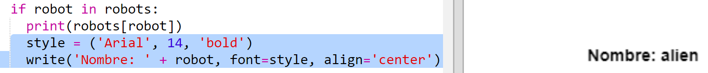

## Visualiza los datos

Ahora podrás visualizar los datos del robot de modo mucho más interesante. 

Visualicemos una carta robótica con una imagen y datos sobre su inteligencia y utilidad. 

Cuando hayas completado este paso, serás capaz de visualizar robots de este modo:

+ Pregunta al usuario qué robot desea ver:

  
  
+ Si el robot está en el diccionario, busca sus datos:

  
  
  Prueba tu código introduciendo el nombre del robot.

  
+ Si robot no existe, recibirás un error.

  
  
 Prueba tu código introduciendo el nombre de un robot que no esté en el diccionario.

+ A continuación, usa la tortuga Python para visualizar los datos del robot. 

  Importa la biblioteca de tortuga en la parte superior de tu script y configura la pantalla y la tortuga:

  

+ A continuación, añade el código para que la tortuga imprima el nombre del robot:

  
  
+ Intenta cambiar la variable `style` hasta que estés satisfecho con el texto. 
  
  En lugar de `Arial`, prueba: `Courier`, `Times` o `Verdana`. 
  
  Cambia `14` a otro número distinto para cambiar el tamaño de la fuente. 
  
  Puedes cambiar `bold` a `normal` o `italic`. 
  
+ Guarda la lista de estadísticas del robot en una variable en lugar de imprimirlas:

  
  
+ Ahora puedes acceder a las estadísticas del robot como elementos de una lista:

  + `stats[0]` es la inteligencia
  + `stats[1]` es la batería
  + `stats[2]` es el nombre de la imagen
  
  Añade un código para visualizar las estadísticas de inteligencia y batería:
  
  
   
  
+ ¡Vaya! Las estadísticas están superpuestas. Necesitarás añadir un código para mover la tortuga:

   

+ Por último, añadamos la imagen del robot para completar la visualización. 

  Necesitarás añadir una línea para registrar la imagen cuando leas los datos de `cards.txt`:
  
  
     
+ Añade un código para colocar y marcar la imagen:

  
  
+ Prueba el código introduciendo un robot y, a continuación otro. ¡Verás que se muestran uno encima del otro!

  Antes de visualizar un robot, debes borrar la pantalla: 

  
