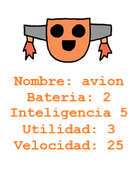

\--- challenge \---

## Desafío: Añadir más estadísticas a los robots

¿Se te ocurren más estadísticas para agregar a los robots? Puedes agregar 'velocidad' o 'utilidad' o proponer tus propias ideas.

Tendrás que:

+ Añade datos al archivo para cada nueva categoría 
+ Agrega la nueva categoría al código que lee los datos
+ Escribe la nueva categoría cuando muestra una carta de triunfo

Incluso puedes agregar un color y mostrar las estadísticas de los robots en su propio color.

Sugerencia: usa `color ('red')` para cambiar el texto de la tortuga a rojo antes de escribir.

Ejemplo:

\--- /challenge \---