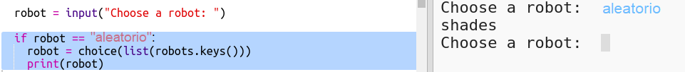

## Visualiza un robot aleatorio

Vamos a añadir código para que obtengas un robot aleatorio cuando escribes Random en lugar del nombre de un robot.

+ Primero necesitarás importar la función choice desde el módulo random:
    
    

+ Puedes utilizar `choice` para elegir un nombre de robot al azar de la lista de las claves del diccionario de robots.
    
    

+ En Python 3 necesitas utilizar `list` para convertir los resultados de `keys` en una lista.
    
    Consejo: ¡Asegúrate de revisar cuidadosamente los paréntesis!