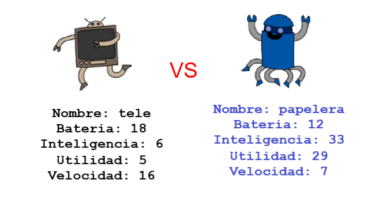

\--- challenge \---

## Desafío: Juega robot trumps con un amigo

Comparte tu proyecto con un amigo y juega Robotrumps. ¡Ambos usan el mismo proyecto para que sea justo! El jugador uno solicita un robot aleatorio y luego elige una categoría. El jugador 2 luego solicita un robot aleatorio y usted verifica quién tiene la puntuación más alta para la categoría elegida, luego cambia.

El juego funciona mejor si ambos juegan con la misma baraja de cartas. Comparte un enlace a tu proyecto de trinket con un amigo para que ambos puedan usar la misma baraja.

\--- /challenge \---