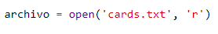
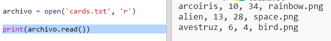
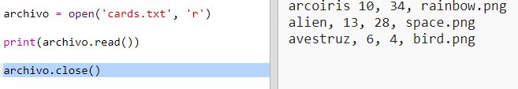
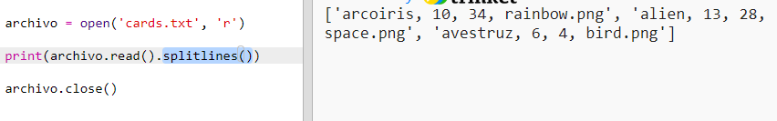
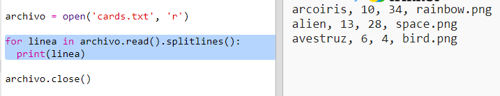
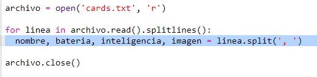
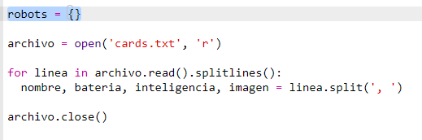
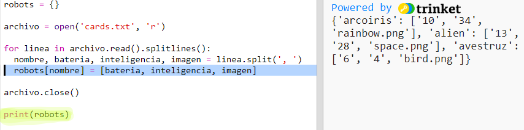

## Lee los datos del robot desde un archivo

A menudo es útil poder leer información de un archivo. Después podrás cambiar los datos en el archivo sin tener que cambiar tu código.

+ Abre este Trinket: <a href="http://jumpto.cc/trumps-go" target="_blank">jumpto.cc/trumps-go</a>.

+ Tu proyecto de inicio incluye un archivo `cards.txt` que contiene datos sobre robots.
    
    Haz clic en `cards.txt` para ver los datos:
    
    
    
    Cada línea tiene datos acerca de un robot. Los elementos de datos están separados por comas.
    
    Cada línea contiene la siguiente información:
    
    nombre, indicador de inteligencia, duración de la batería, nombre del archivo de imagen

+ Vamos a leer los datos del archivo para que puedas usarlos.
    
    El primer paso es abrir el archivo `cards.txt` en tu script:
    
    

+ Ahora puedes leer los datos del archivo:
    
    

+ Siempre debes cerrar el archivo cuando hayas terminado con él:
    
    

+ Eso nos da el archivo como una sola cadena, es necesario dividirlo en piezas individuales de datos.
    
    Primero, puedes dividir el archivo en una lista de líneas:
    
    
    
    Mira con cuidado los datos de salida. Hay tres elementos en la lista, cada uno es una línea del archivo.

+ Ahora puedes hacer un bucle que recorra esas líneas una a la vez
    
    

+ En lugar de imprimir las líneas, vamos a transformarlas en variables:
    
    

+ Lo que quieres es ser capaz de utilizar estos datos más adelante para buscar los valores de un robot en particular. Usemos el nombre del robot como la clave del diccionario.
    
    Agrega un diccionario de `robots`:
    
    

+ Ahora vamos a añadir una entrada al diccionario de robots para cada robot.
    
    El nombre es la clave y el valor es una lista de datos para ese robot.
    
    Añade el código resaltado:
    
    
    
    Puedes eliminar la línea de código `print robots` cuando hayas probado tu script.