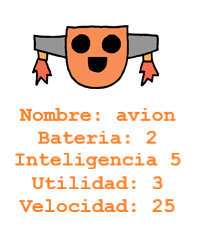

--- challenge ---

## Reto: Añadir más estadísticas a los robots

¿Se te ocurren más estadísticas para añadir a los robots? Puedes agregar 'velocidad' o 'utilidad' o añadir tus propias ideas.

Tendrás que:

+ Añadir datos al archivo para cada nueva categoría 
+ Agregar la nueva categoría al código que lee los datos
+ Escribir la nueva categoría cuando se muestre una carta robótica

Incluso puedes agregar un color y mostrar las estadísticas de los robots en su propio color.

Sugerencia: usa `color ('red')` para cambiar el texto de 'turtle' a rojo antes de escribir.

Ejemplo:

--- /challenge ---