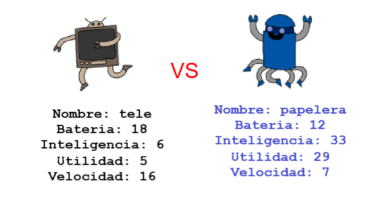

\--- challenge \---

## Desafío: Juega a Cartas robóticas con un amigo

Comparte tu proyecto con un amigo y juega a Cartas Robóticas. ¡Ambos usen el mismo proyecto para que sea justo! El jugador uno solicita un robot aleatorio y luego elige una categoría. Después, el jugador 2 solicita un robot aleatorio y comprueba quién tiene la puntuación más alta para la categoría elegida, luego los jugadores se alternan.

El juego funciona mejor si ambos juegan con la misma baraja de cartas. Comparte un enlace de tu proyecto de trinket con un amigo para que ambos puedan usar la misma baraja.

\--- /challenge \---