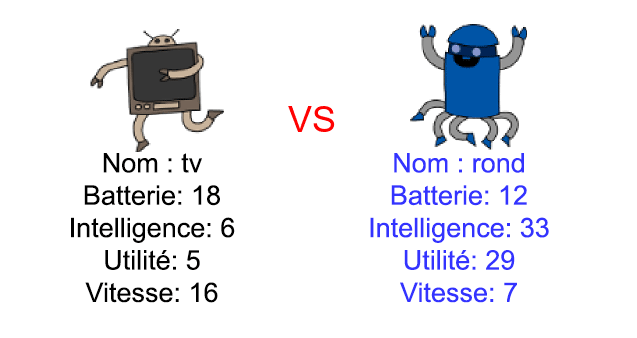

## Introduction

Dans ce projet, tu vas lire les données à partir d’un fichier pour créer des atouts de robot. Ensuite, tu peux jouer à Robo-Atout avec un ami.

  <iframe src="https://trinket.io/embed/python/9ccc368bd5?outputOnly=true&start=result" width="600" height="500" frameborder="0" marginwidth="0" marginheight="0" allowfullscreen>
  </iframe>
  

### Informations complémentaires pour les responsables de club

Si vous avez besoin d'imprimer ce projet, merci d'utiliser la [Version imprimable](https://projects.raspberrypi.org/en/projects/robo-trumps/print).

## \--- collapse \---

## title: Notes pour le responsable de club

## Introduction:

Dans ce projet, vous allez lire les données à partir d’un fichier pour créer des atouts de robot. Les cartes peuvent ensuite être utilisées pour jouer à Robo-Atout avec un ami.

## Ressources en-ligne

**Ce projet utilise Python 3.** Nous recommandons l'utilisation de [Trinket](https://trinket.io/) pour écrire du code Python en-ligne. Ce projet contient les Trinkets suivants :

* [Point de départ "Roboatout" - jumpto.cc/trumps-go](http://jumpto.cc/trumps-go)

Il y a aussi un Trinket contenant un exemple de solution pour les défis :

* ['Roboatout' terminé - trinket.io/python/9ccc368bd5](https://trinket.io/python/9ccc368bd5)

## Ressources hors-ligne

Ce projet peut être [terminé hors-ligne](https://www.codeclubprojects.org/en-GB/resources/python-working-offline/) si désiré. Vous pouvez accéder aux ressources du projet en cliquant sur le lien "Matériels du projet". Ce lien contient une section "Ressources du projet" qui inclut les ressources dont les enfants auront besoin pour terminer le projet hors-ligne. Assurez-vous que les enfants ont accès à une copie de ces ressources. Cette section inclut les fichiers suivants :

* robotrumps/robotrumps.py
* robotrumps/cards.txt
* Plusieurs images .gif de robot

Vous pouvez aussi trouver une version terminée du projet dans la section "Ressources du bénévole" qui contient :

* robotrumps-finished/robotrumps.py
* robotrumps-finished/cards.txt
* Plusieurs images .gif de robot

(Toutes les ressources ci-dessus peuvent aussi être téléchargées dans les fichiers `.zip` projet et bénévole)

## Objectifs d'apprentissage

* Consolidation: structures de données, lecture à partir de fichier et graphiques turtle;
* Utiliser des images dans les graphiques turtle;
* Partage de projets trinket.

Ce projet traite les éléments suivants du [Programme Raspberry Pi de Création Numérique](http://rpf.io/curriculum):

* [Combiner des constructions de programmation pour résoudre un problème.](https://www.raspberrypi.org/curriculum/programming/builder)

## Défis

* Ajouter plus de robots - Éditer un fichier .txt et travailler avec des images;
* Ajouter plus de statistiques aux robots - traitement des données;
* Jouer à Roboatout avec un ami.

## Foire aux questions

* **Python hors-ligne ne fonctionne pas avec les images .png. Les images .gif ont été fournies pour une utilisation hors ligne.**
* Notez que ce projet utilise à la fois la saisie de texte et les graphiques turtle, vous pouvez ajuster la quantité d'espace donnée de chacun dans trinket.
* Vous devez cliquer dans la fenêtre de texte du trinket avant de taper.
* Les enfants peuvent utiliser l'option «Partager» dans trinket pour obtenir un lien vers leur projet. S'ils ont accès au courrier électronique, ils peuvent ensuite envoyer le lien par courrier électronique à un ami. Sinon, ils peuvent simplement le lire, le noter sur un morceau de papier ou l'enregistrer dans un fichier texte sur le réseau local.

\--- /collapse \---

## \--- collapse \---

## title: Matériels pour le projet

## Ressources du projet

* [Fichier .zip contenant toutes les ressources du projet](resources/robo-trumps-project-resources.zip)
* [Trinket en ligne contenant les ressources de démarrage de 'Robo-Atout](http://jumpto.cc/trumps-go)
* [robo-trumps/robo-trumps.py](resources/robo-trumps-robo-trumps.py)
* [robo-trumps/cards.txt](resources/robo-trumps-cards.txt)
* [robo-trumps/space.gif](resources/robo-trumps-space.gif)
* [robo-trumps/rainbow.gif](resources/robo-trumps-rainbow.gif)
* [robo-trumps/bird.gif](resources/robo-trumps-bird.gif)
* [robo-trumps/dog.gif](resources/robo-trumps-dog.gif)
* [robo-trumps/jet.gif](resources/robo-trumps-jet.gif)
* [robo-trumps/round.gif](resources/robo-trumps-round.gif)
* [robo-trumps/brains.gif](resources/robo-trumps-brains.gif)
* [robo-trumps/twoheads.gif](resources/robo-trumps-twoheads.gif)
* [robo-trumps/shades.gif](resources/robo-trumps-shades.gif)
* [robo-trumps/hair.gif](resources/robo-trumps-hair.gif)
* [robo-trumps/tv.gif](resources/robo-trumps-tv.gif)
* [robo-trumps/yellow.gif](resources/robo-trumps-yellow.gif)

## Ressources pour le responsable de club

* [Fichier .zip contenant toutes les ressources du projet terminé](resources/robotrumps-volunteer-resources.zip)
* [Projet Trinket en-ligne terminé](https://trinket.io/python/9ccc368bd5)
* [robo-trumps-finished/robo-trumps.py](resources/robo-trumps-finished-robo-trumps.py)
* [robo-trumps-finished/cards.txt](resources/robo-trumps-finished-cards.txt)
* [robo-trumps-finished/space.gif](resources/robo-trumps-finished-space.gif)
* [robo-trumps-finished/rainbow.gif](resources/robo-trumps-finished-rainbow.gif)
* [robo-trumps-finished/bird.gif](resources/robo-trumps-finished-bird.gif)
* [robo-trumps-finished/dog.gif](resources/robo-trumps-finished-dog.gif)
* [robo-trumps-finished/jet.gif](resources/robo-trumps-finished-jet.gif)
* [robo-trumps-finished/round.gif](resources/robo-trumps-finished-round.gif)
* [robo-trumps-finished/brains.gif](resources/robo-trumps-finished-brains.gif)
* [robo-trumps-finished/twoheads.gif](resources/robo-trumps-finished-twoheads.gif)
* [robo-trumps-finished/shades.gif](resources/robo-trumps-finished-shades.gif)
* [robo-trumps-finished/hair.gif](resources/robo-trumps-finished-hair.gif)
* [robo-trumps-finished/tv.gif](resources/robo-trumps-finished-tv.gif)
* [robo-trumps-finished/yellow.gif](resources/robo-trumps-finished-yellow.gif)

\--- /collapse \---