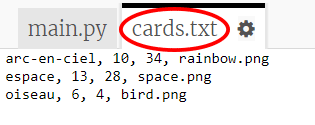
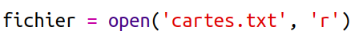
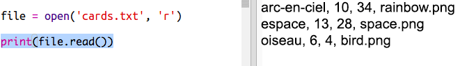
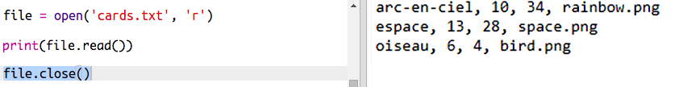
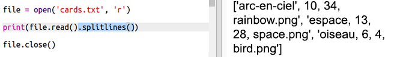
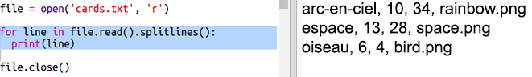
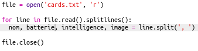
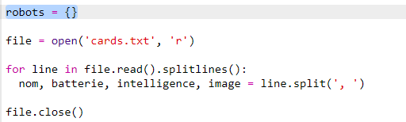
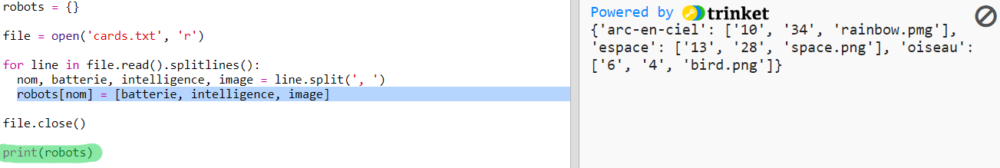

## Lire des données des robots à partir d'un fichier

Il est très souvent utile de pouvoir lire de l'information à partir d'un fichier. Tu peux ainsi changer les données dans le fichier sans avoir besoin de changer ton code.

+ Ouvre ce trinket :  <a href="http://jumpto.cc/trumps-go" target="_blank">jumpto.cc/trumps-go</a>.

+ Ton projet de démarrage comporte un fichier `cards.txt` qui contient les données à propos des robots.

  Clique sur `cards.txt` pour voir les données :

  

  Chaque ligne contient des informations concernant un robot. Chaque élément d'information est séparé par une virgule.

  Chaque ligne contient les informations suivantes :

  nom, niveau d'intelligence, autonomie de batterie, nom de fichier image

+ Lisons les données à partir du fichier pour pouvoir s'en servir.

  La première étape est d'ouvrir le fichier `cards.txt` dans ton script :

  

+ Maintenant tu peux lire les donnnées à partir du fichier :

  

+ Tu devrais toujours fermer le fichier quand tu as fini de le traiter :

  

+ Ça nous transforme le fichier en une seule chaîne de caractères que tu dois par la suite décomposer dans des éléments individuels d'information.

  D'abord, tu peux découper le fichier dans une liste de lignes :

  

  Regarde attentivement la sortie. IL y a trois éléments dans la liste, chacun est une ligne du fichier.

+ Maintenant tu peux traiter en boucle les lignes, l'une après l'autre.

  

+ Au lieu d'afficher les lignes, stocke les dans des variables.

  

+ Tu veux utiliser ces informations plus tard pour chercher les valeurs d'un robot en particulier. Utiliisons le nom du robot comme clé de dictionnaire.

  Ajoute un dictionaire `robots` :

  

+ Maintenant ajoutons un article au dictionnaire pour chaque robot.

  Le nom du robot est la clé et la valeur est une liste de données concernant ce robot.

  Ajouter le code en surbrillance :

  

  Tu peux retirer `print robots` dès que tu as testé ton script.
