## Afficher les données

Tu peux maintenant afficher les données du robot de manière plus intéressante.

Montrons un atout de robot avec une image et des données pour son intelligence et son utilité.

Une fois cette étape terminée, tu pourras afficher les robots comme suit:

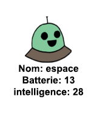

+ Demande à l'utilisateur quel robot il aimerait voir:
    
    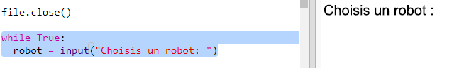

+ Si le robot est dans le dictionnaire, alors recherche ses données:
    
    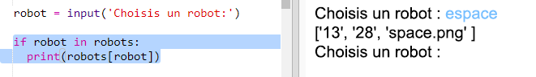
    
    Teste ton code en entrant un nom de robot.

+ Si le robot n'existe pas, alors ça indique une erreur:
    
    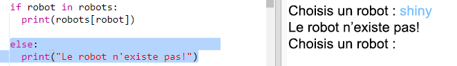
    
    Teste ton code en entrant un nom de robot qui ne figure pas dans le dictionnaire.

+ Tu vas maintenant utiliser le turtle Python pour afficher les données du robot.
    
    Importe la bibliothèque turtle en haut de ton script et configure l’écran et turtle:
    
    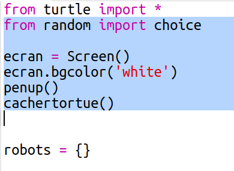

+ Ajoute maintenant du code pour que turtle imprime le nom du robot:
    
    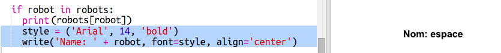

+ Essaie de changer la variable `style` jusqu'à ce que tu sois satisfait du texte.
    
    Au lieu de `Arial` tu peux essayer: `Courier`, `Times` ou `Verdana`.
    
    Change `14` à un autre numéro pour changer la taille de la police.
    
    Tu peux changer `bold` à `normal` ou `italic`.

+ Stocke la liste des statistiques du robot dans une variable au lieu de les imprimer:
    
    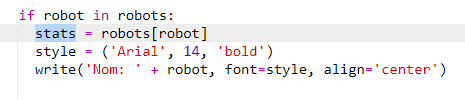

+ Tu peux maintenant accéder aux statistiques du robot en tant qu'éléments d'une liste:
    
    + `stats[0]` est l'intelligence
    + `stats[1]` est la batterie
    + `stats[2]` est le nom de l'image
    
    Ajoute du code pour afficher l'intelligence et les statistiques de la batterie:
    
    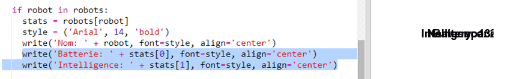

+ Oh ! Les statistiques sont toutes superposées. Tu auras besoin d'ajouter du code pour déplacer le turtle:
    
    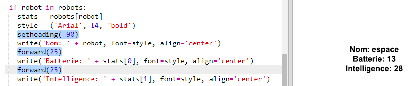

+ Et enfin, ajoutons l'image du robot pour compléter l'affichage.
    
    Tu devras ajouter une ligne pour enregistrer l'image lorsque tu liras les données à partir de `cards.txt`:
    
    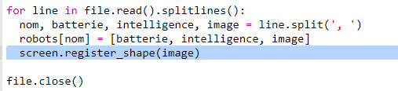

+ Et ajoute du code pour positionner et tamponner l'image:
    
    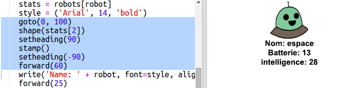

+ Teste ton code en entrant un robot, puis un autre, et tu verras qu'ils s'affichent les uns sur les autres!
    
    Tu devras effacer l'écran avant d'afficher un robot:
    
    