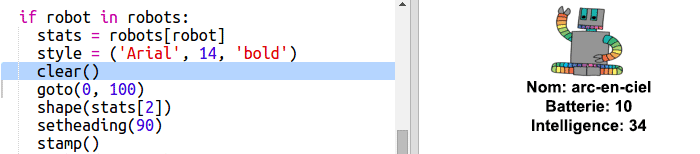

## Afficher les données

Maintenant tu peux afficher les données de robot de façon plus intéressante.

Affichons les cartes de jeu "Robot-Atout" avec une image et les données concernant son intelligence et son utilité.

Quand tu auras complété cette étape, ça sera possible d'afficehr les robots comme suit :

+ Demande à l'utilisatrice quel robot elle aimerait voir :

  

+ Si le robot est dans le dictionnaire, cherchons ses données :

  

  Teste ton code en entrant le nom d'un robot.

+ Si le robot n'existe pas, affiche un message d'erreur :

  

 Teste ton code en entrant le nom d'un robot qui n'est pas dans le dictionnaire.

+ Maintenant tu vas utiliser la "Tortue" (turtle) Python pour afficher les données des robots.

  Importe la bibliothèque Turtle en haut de ton script et mettre en place l'écran et la tortue :

  

+ Maintenant ajoute le code pour que la tortue affiche le nom du robot :

  

+ Essaye de changer la variable `style` jusqu'à ce que tu sois satisfait du texte.

  Au lieu de la police `Arial` tu pourrais essayer : `Courier`, `Times` ou `Verdana`.

  Change `14` pour un autre valeur afin de changer la taille de police.

  Tu peux changer `bold` en `normal` ou `italic`.

+ Stocke la liste de statistiques pour le robot dans une variable au lieu de les afficher à l'écran :

  

+ Tu peux désormais accéder aux statistiques des robots comme des éléments dans une liste :

  + `stats[0]` est l'intelligence
  + `stats[1]` est l'autonomie
  + `stats[2]` est le nom de l'image

  Ajoute du code pour afficher les stats d'intelligence et d'autonomie :

  

+ Uh-oh ! Les stats sont empilées les unes sur les autres. Tu auras besoin d'ajouter du code pour bouger la tortue :

   

+ Et enfin, ajoutons l'image du robot afin de compléter l'affichage.

  Tu as besoin d'ajouter une ligne quand tu lis les données à partir de `cards.txt` :

  

+ Et ajoute le code pour positionner et tamponner l'image :

  

+ Test ton code en entrant un robot, puis un autre et tu verras qu'ils s'affichent les uns sur les autres !

  Tu devrais vider l'écran avec d'afficher un robot :

  
