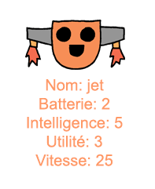

--- challenge ---

## Défi: ajoute plus de stats aux robots

Peux-tu penser à plus de statistiques à ajouter aux robots. Tu pourrais ajouter «vitesse» ou «utilité» ou proposer tes propres idées.

Tu auras besoin d':

+ Ajouter des données au fichier pour chaque nouvelle catégorie 
+ Ajouter la nouvelle catégorie au code qui lit les données
+ Écrire la nouvelle catégorie lorsque tu affiches un atout

Tu peux même ajouter une couleur et afficher les statistiques des robots dans leur propre couleur.

Astuce: Utilise `color('red')` pour changer le texte de turtle en rouge avant d'écrire.

Exemple:

--- /challenge ---