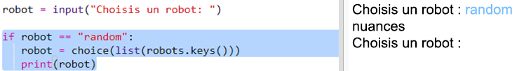

## Afficher un robot de façon aléatoire

Ajoutons du code pour qu'un robot selectionné aléatoirement s'affiche quand tu tapes Random au lieu du nom d'un robot.

+ D'abord tu auras besoin d'importer la fonction de choix du module "random" :

  

+ Tu peux utiliser `choice` pour choisir un nom de robot aléatoire de la liste des clés du dictionnaire robot.

  

