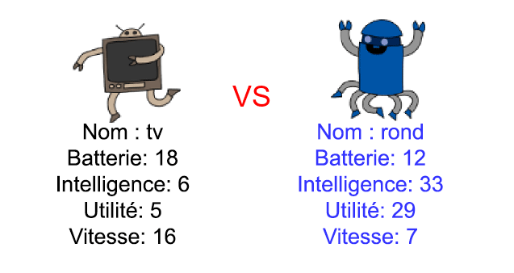

--- challenge ---
## Défi : Joue à Robot-Atout avec un ami 
Partage ton projet avec un amis et jouez à Robot-Atout. Les deux joueurs devraient utiliser le même projet pour que ça soit juste pour tout le monde ! Joueur 1 demande un robot aléatoire, puis il choisit une catégorie. Ensuite Joueur 2 demande un robot aléatoire et vous vérifiez qui de vous deux a le score le plus élèvé pour la catégorie choisie, puis vous inversez les rôles.

Le jeu se déroule au mieux si vous jouez tous les deux avec le même jeu de cartes. Partage le lien vers ton projet Trinket avec un ami pour pouvoir utiliser le même jeu de cartes.

--- /challenge ---