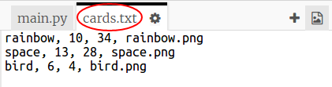
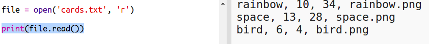

## फाइल से रोबोट डेटा पढ़ें।

फाइल से जानकारी पढ़ने में सक्षम होना अक्सर उपयोगी होता है। इसके बाद आप कोड में परिवर्तन किए बिना फाइल में डेटा में परिवर्तन कर सकते हैं। 

+ इस ट्रिंकेट को खोलें: <a href="http://jumpto.cc/trumps-go" target="_blank">jumpto.cc/trumps-go</a>. 

+ आपके आरंभिक प्रोजेक्ट में `cards.txt` फाइल शामिल होती है, जिसमें रोबोट्स के बारे में डेटा निहित होता है। 

  डेटा देखने के लिए `cards.txt` पर क्लिक करें:

  

  प्रत्येक पंक्ति में रोबोट के बारे में डेटा निहित होता है। डेटा आइटम्स को कॉमा द्वारा अलग किया जाता है। 

  प्रत्येक पंक्ति में निम्नलिखित जानकारी होती है:

  नाम, इंटेलिजेंस रेटिंग, बैटरी कितने समय तक चल सकती है, इमेज फाइल का नाम

+ चलिए फाइल में से डेटा पढ़ें, ताकि आप इसे उपयोग कर सकें। 

  प्रथम चरण है, अपने स्क्रिप्ट में `cards.txt` फाइल खोलें:
  
  
  
+ अब आप फाइल में से डेटा पढ़ सकते हैं:

  
  
+ काम खत्म होने पर हमेशा फाइल को बंद कर देना चाहिए:

  

+ इससे हमें स्ट्रिंग के रूप में फाइल प्राप्त होती है, आपको इसे डेटा के अलग-अलग टुकड़ों में विभाजित करने की आवश्यकता होती है। 

  सबसे पहले, आप फाइल को पंक्तियों की सूची में विभाजित कर सकते हैं:

  
  
  आउटपुट को ध्यान से देखें। सूची में तीन आइटम्स होते हैं, जिनमें से प्रत्येक फाइल की एक पंक्ति है। 
  
+ अब आप एक समय में उन पंक्तियों में लूप लगा सकते हैं

  
  
+ पंक्तियों को प्रिंट करने के बजाय, उन्हें वेरिएबल में पढ़ें:

  
  
+ विशेष रोबोट के लिए मान देखने के लिए बाद, आप इस डेटा का उपयोग करने में सक्षम होना चाहेंगे। चलिए रोबोट के नाम को डिक्शनरी की कुंजी के रूप में उपयोग करें। 

  `रोबोट्स` डिक्शनरी जोड़ें:

  
  
+ चलिए अब प्रत्येक रोबोट के लिए रोबोट्स डिक्शनरी में एंट्री जोड़ें। 

  उस रोबोट के लिए नाम कुंजी होती है और मान डेटा की सूची होती है। 

  हाइलाइट किया गया कोड जोड़ें:
 
  
  
  अपनी स्क्रिप्ट का परीक्षण करने पर, आप `प्रिंट रोबोट्स` को हटा सकते हैं। 

