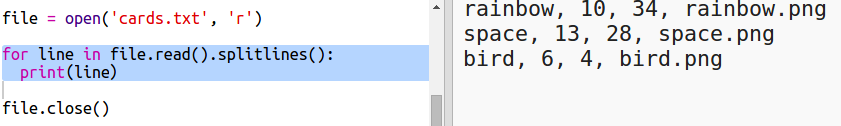

## फाइल से रोबोट डेटा पढ़ें

फ़ाइल से जानकारी पढ़ने में सक्षम होना अक्सर उपयोगी होता है। फिर आप अपना कोड बदले बिना फ़ाइल में डेटा बदल सकते हैं।

+ इस trinket को खोलें: <a href="http://jumpto.cc/trumps-go" target="_blank">jumpto.cc/trumps-go</a>।

+ आपके शुरूआती प्रोजेक्ट में एक `cards.txt` फ़ाइल है जिसमें रोबोट के बारे में डेटा है।
    
    `cards.txt` पर क्लिक करें डेटा देखने के लिए:
    
    
    
    प्रत्येक पंक्ति में एक रोबोट के बारे में डेटा है। डेटा आइटम अल्पविराम द्वारा अलग किए गए हैं।
    
    प्रत्येक पंक्ति में निम्नलिखित जानकारी है:
    
    नाम, बुद्धिमत्ता रेटिंग, बैटरी कितनी देर तक चलती है, चित्र फ़ाइल नाम

+ चलिए फ़ाइल से डेटा पढ़ते हैं ताकि आप इसका उपयोग कर सकें।
    
    पहला कदम आपकी स्क्रिप्ट में `cards.txt` फ़ाइल को खोलना है:
    
    

+ अब आप फ़ाइल से डेटा पढ़ सकते हैं:
    
    

+ आपको हमेशा फाइल बंद करनी चाहिए जब आप उसे पूरा कर लें:
    
    

+ वह फ़ाइल हमें एक स्ट्रिंग के रूप में देता है, आपको इसे अलग-अलग डेटा के टुकड़ों में तोड़ने की आवश्यकता है।
    
    सबसे पहले, आप फ़ाइल को पंक्तियों की सूची में विभाजित कर सकते हैं:
    
    
    
    आउटपुट को ध्यान से देखें। सूची में तीन आइटम हैं, प्रत्येक फ़ाइल से एक पंक्ति है।

+ अब आप बारी बारी से उन पंक्तियों को लूप कर सकते हैं
    
    

+ पंक्तियों को प्रिंट करने के बजाय, उन्हें वेरिएबल में पढ़ें:
    
    

+ आप किसी विशेष रोबोट के मूल्यों को देखने के लिए बाद में इस डेटा का उपयोग करने में सक्षम होना चाहते हैं। चलिए शब्दकोश की कुंजी के रूप में रोबोट के नाम का उपयोग करते हैं।
    
    एक `robots` शब्दकोश जोड़ें:
    
    

+ अब प्रत्येक रोबोट के लिए robots शब्दकोश में एक प्रविष्टि जोड़ें।
    
    नाम कुंजी है और मान उस रोबोट के डेटा की एक सूची है।
    
    हाइलाइट किए गए कोड को जोड़ें:
    
    
    
    अपने कोड का परीक्षण कर लेने के बाद आप `print robots` पंक्ति को निकाल सकते हैं।