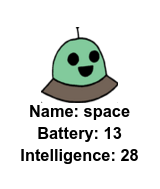

## डेटा प्रदर्शित करें

अब आप रोबोट डेटा को अधिक रोचक तरीके से प्रदर्शित कर सकते हैं।

आइए अपनी बुद्धि और उपयोगिता के लिए एक छवि और डेटा के साथ एक रोबोट ट्रम्प कार्ड प्रदर्शित करें।

जब आप यह चरण पूरा कर लेंगे, तो आप इस तरह से रोबोट प्रदर्शित कर सकेंगे:

+ उपयोगकर्ता से पूछें कि वे कौन सा रोबोट देखना चाहते हैं:
    
    

+ यदि रोबोट शब्दकोश में है तो उसका डेटा देखें:
    
    
    
    रोबोट नाम दर्ज करके अपने कोड का परीक्षण करें।

+ यदि रोबोट मौजूद नहीं है, तो एक त्रुटि दें:
    
    
    
    एक रोबोट नाम दर्ज करके अपने कोड का परीक्षण करें जो शब्दकोश में नहीं है।

+ अब आप रोबोट डेटा प्रदर्शित करने के लिए पायथन टर्टल का उपयोग करने जा रहे हैं।
    
    अपनी स्क्रिप्ट के शीर्ष पर टर्टल लाइब्रेरी आयात करें और स्क्रीन और टर्टल को सेटअप करें:
    
    

+ अब टर्टल को रोबोट का नाम प्रिंट करने के लिए कोड जोड़ें:
    
    

+ `style` वेरिएबल बदलने का प्रयास करें जब तक आप पाठ से खुश हैं।
    
    `Arial` के बजाय आप कोशिश कर सकते हैं: `Courier`, `Times` or `Verdana`.
    
    बदलें `14` फ़ॉन्ट का आकार बदलने के लिए एक अलग संख्या में।
    
    आप `bold` कोबदल सकते हैं `normal` या ` italic`में.

+ रोबोट के लिए आंकड़ों की सूची को प्रिंट करने के बजाय एक वेरिएबल में संग्रहीत करें:
    
    

+ अब आप एक सूची में आइटम के रूप में रोबोट के लिए आँकड़े तक पहुँच सकते हैं:
    
    + `stats[0]` बुद्धि है
    + `stats[1]` बैटरी है
    + `stats[2]` छवि का नाम है
    
    बुद्धि और बैटरी आँकड़े प्रदर्शित करने के लिए कोड जोड़ें:
    
    

+ ओ प्यारे! आँकड़े एक दूसरे के ऊपर हैं। टर्टल का स्थान बदलने के लिए आपको कोड जोड़ना होगा:
    
    

+ और अंत में, चलो प्रदर्शन को पूरा करने के लिए रोबोट छवि जोड़ें।
    
    जब आप `cards.txt` से डेटा पढ़ते हैं तो आपको छवि को पंजीकृत करने के लिए एक पंक्ति जोड़ने की आवश्यकता होगी:
    
    

+ और छवि में स्थिति और मोहर लगाने के लिए कोड जोड़ें:
    
    

+ पहले एक रोबोट और फिर एक और रोबोट दर्ज करके अपने कोड का परीक्षण करें और आप देखेंगे कि वे एक दूसरे के ऊपर प्रदर्शित होते हैं!
    
    रोबोट प्रदर्शित करने से पहले आपको स्क्रीन साफ़ करनी होगी:
    
    