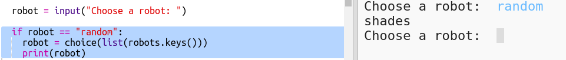

## एक यादृच्छिक रोबोट प्रदर्शित करें

आइए कोड जोड़ें ताकि जब आप रोबोट के नाम के बजाय Random टाइप करें, आपको एक यादृच्छिक रोबोट मिल जाए।

+ पहले आपको रैंडम मॉड्यूल से चॉइस (choice) फ़ंक्शन आयात करना होगा:
    
    

+ रोबोट शब्दकोश से कुंजियों की सूची से यादृच्छिक रोबोट नाम चुनने के लिए, आप `choice` का उपयोग कर सकते हैं |
    
    

+ Python 3 में आपको `keys` के परिणामों को एक सूची में बदलने के लिए `list` का उपयोग करना होगा।
    
    टिप: सुनिश्चित करें कि आप अपने कोष्ठक को ध्यान से देखें!