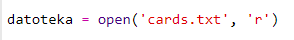
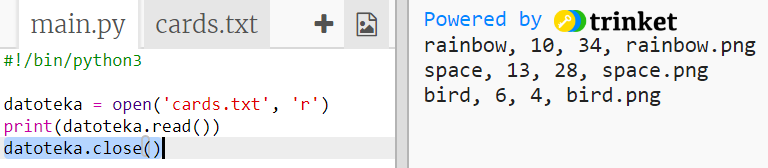
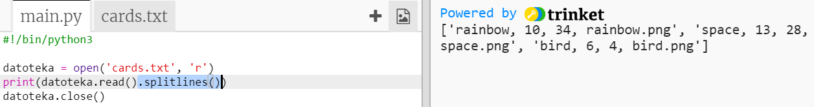

## Učitaj podatke o robotu iz datoteke

Često je korisno moći učitati podatke iz datoteke. Na taj način ne trebaš mijenjati svoj kôd, već možeš izmijeniti podatke unutar datoteke.

+ Otvori ovaj trinket: <a href="http://trinket.io/python/384d064e44" target="_blank">trinket.io/python/384d064e44</a>.

+ U tvom početnom projektu nalazi se datoteka `cards.txt` koja sadrži podatke o robotima.
    
    Klikni na `cards.txt` za pregled podataka:
    
    
    
    Svaka linija sadrži podatke o jednom robotu. Podatci unutar linija odvojeni su zarezima.
    
    Svaka linija sadrži sljedeće podatke:
    
    ime, razinu inteligencije, izdrživost baterije, naziv slikovne datoteke

+ Učitajmo podatke iz datoteke kako bismo ih mogli koristiti.
    
    Prvo otvori datoteku `cards.txt` u svom programu:
    
    

+ Sada možeš učitati podatke iz datoteke:
    
    

+ Uvijek zatvori datoteku nakon što završiš s njenim korištenjem:
    
    

+ Time smo ispisali podatke kao jedan niz. Rastavimo ga na pojedinačne dijelove podataka.
    
    Prvo možeš ispisati podatke u obliku liste koja se sastoji od linija:
    
    
    
    Pažljivo pogledaj ispis. U listi se nalaze tri elementa, a svaki je element jedna linija iz datoteke.

+ Sada možeš petljom proći kroz svaku liniju posebno
    
    

+ Umjesto ispisivanja linija, pohrani ih u varijable:
    
    

+ Želiš da ti ovi podatci budu i kasnije dostupni za pronalaženje vrijednosti određenog robota. Koristit ćemo ime robota kao ključ u rječniku.
    
    Kreiraj rječnik naziva `roboti`:
    
    

+ Dodajmo sada unos za svakog robota u rječnik roboti.
    
    Ime robota je ključ, a lista podataka za tog robota je vrijednost.
    
    Dodaj označeni kôd:
    
    
    
    Možeš maknuti naredbu `print roboti` nakon testiranja kôda.