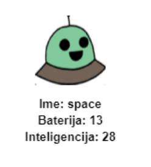
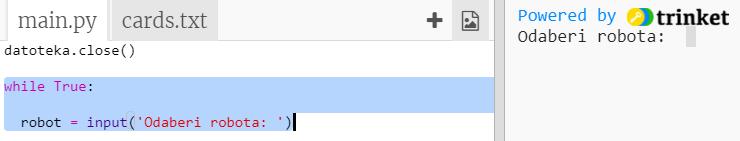
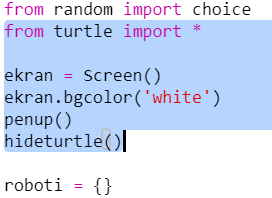
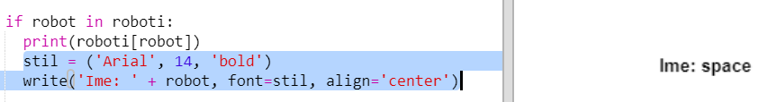
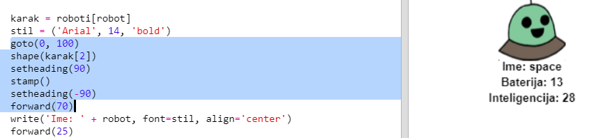

## Display the data

Now you can display the robot data in a more interesting way.

Let’s display a robot trump card with an image and data for its intelligence and usefulness.

When you've completed this step you'll be able to display robots like this:

+ Ask the user which robot they would like to see:
    
    

+ If the robot is in the dictionary then lookup its data:
    
    
    
    Test your code by entering a robot name.

+ If the robot doesn't exist then give an error:
    
    
    
    Test your code by entering a robot name that isn't in the dictionary.

+ Now you're going to use the Python turtle to display the robot data.
    
    Import the turtle library at the top of your script and setup the screen and turtle:
    
    

+ Now add code to get the turtle to print the name of the robot:
    
    

+ Try changing the `style` variable until you are happy with the text.
    
    Instead of `Arial` you could try: `Courier`, `Times` or `Verdana`.
    
    Change `14` to a different number to change the size of the font.
    
    You can change `bold` to `normal` or `italic`.

+ Store the list of stats for the robot in a variable instead of printing them out:
    
    

+ You can now access the stats for the robot as items in a list:
    
    + `stats[0]` is intelligence
    + `stats[1]` is battery
    + `stats[2]` is the image name
    
    Add code to display the intelligence and battery stats:
    
    

+ Oh dear! The stats are all on top of each other. You'll need to add code to move the turtle:
    
    

+ And finally, let's add the robot image to complete the display.
    
    You'll need to add a line to register the image when you read the data from `cards.txt`:
    
    

+ And add code to position and stamp the image:
    
    

+ Test your code by entering one robot and then another and you'll see that they display on top of each other!
    
    You need to clear the screen before displaying a robot:
    
    