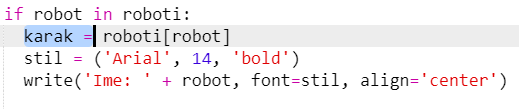
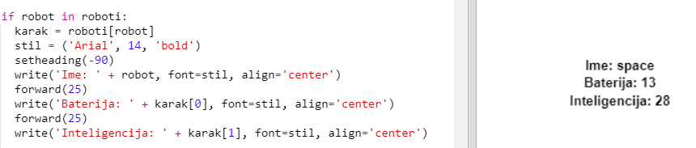

## Prikaži podatke

Sada možeš prikazati podatke o robotima na zanimljiviji način.

Prikažimo kartu robota sa slikom i podatcima o njegovoj inteligenciji i korisnosti.

Kada to napraviš moći ćeš prikazati robote na ovaj način:

+ Pitaj korisnika da odabere robota:
    
    

+ Ako se robot nalazi u rječniku, potraži njegove podatke:
    
    
    
    Testiraj kôd unošenjem imena robota.

+ Ako robot ne postoji, prikaži poruku o grešci:
    
    
    
    Testiraj kôd unošenjem imena robota koji se ne nalazi u rječniku.

+ Sada ćeš koristiti Python turtle za prikazivanje podataka robota.
    
    Uvezi turtle biblioteku na početku svog kôda i podesi ekran i turtle:
    
    

+ Zatim dodaj kôd kojim će turtle ispisati ime robota:
    
    

+ Izmjenjuj varijablu `stil` dok ne budeš zadovoljan sa izgledom teksta.
    
    Umjesto stila `Arial` možeš iskušati stilove: `Courier`, `Times` ili `Verdana`.
    
    Promijeni `14` u neki drugi broj za izmjenu veličine fonta.
    
    Možeš promijeniti `bold` u `normal` ili `italic`.

+ Umjesto ispisivanja karakteristika robota, pohrani ih u varijablu:
    
    

+ Sada možeš karakteristikama robota pristupati kao elementima liste:
    
    + `karak[0]` označava inteligenciju
    + `karak[1]` označava bateriju
    + `karak[2]` označava naziv slikovne datoteke
    
    Dodaj kôd koji će prikazivati karakteristike inteligencije i baterije:
    
    

+ Oh ne! Karakteristike se ispisuju jedna preko druge. Moramo dodati kôd kojim će se turtle pomaknuti:
    
    

+ Konačno, dodajmo sliku robota za upotpunjavanje prikaza.
    
    Moraš dodati liniju za prepoznavanje slike pri učitavanju podataka iz datoteke `cards.txt`:
    
    

+ Dodaj i kôd za postavljanje slike:
    
    

+ Testiraj kôd unošenjem jednog robota pa drugog i vidjet ćeš da se prikazuju jedan na drugome!
    
    Moraš obrisati sve sa zaslona prije prikazivanja robota:
    
    