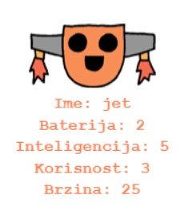

--- challenge ---

## Izazov: Dodaj još karakteristika robotima

Možeš li smisliti još karakteristika koje ćeš dodati robotima? Možeš dodati 'brzinu' ili 'korisnost' ili smisliti nešto drugo.

Trebaš učiniti sljedeće:

+ Dodati podatke u datoteku za svaku novu karakteristiku 
+ Dodati novu karakteristiku dijelu kôda koji učitava podatke
+ Ispisati novu karakteristiku pri prikazivanju karte robota

Možeš dodati i boju i prikazati karakteristike svakog robota u drugoj boji.

Pomoć: Koristi`color('red')` za promjenu turtle teksta u crvenu prije pisanja.

Primjer:

--- /challenge ---