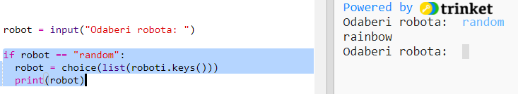

## Prikaži nasumičnog robota

Dodajmo kôd kojim ćeš dobiti nasumično odabranog robota kada upišeš Random umjesto njegovog imena.

+ Prvo moraš uvesti choice funkciju iz modula random:
    
    

+ Možeš koristiti `choice` za odabir nasumičnog imena robota iz liste ključeva u rječniku roboti.
    
    

+ U Pythonu 3 moraš koristiti `list` za pretvaranje rezultata `ključeva` u listu.
    
    Savjet: Pripazi na zagrade!