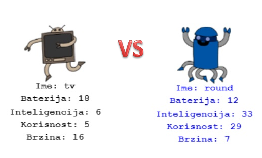

--- challenge ---

## Izazov: Igraj Borbe robota s prijateljem

Podijeli svoj projekt s prijateljem i zaigrajte Borbe robota. Oboje koristite isti projekt da bude pošteno! Prvi igrač poziva nasumično odabranog robota, a zatim bira kategoriju. Tada i drugi igrač poziva nasumično odabranog robota, a zatim provjeravate tko ima najviši rezultat u odabranoj kategoriji. Nakon toga se mijenjate.

Igra najbolje funkcionira ako oboje igrate sa istim špilom karata. Podijeli link svog trinket projekta sa prijateljem kako bi oboje mogli koristiti isti špil.

--- challenge ---

***

## Prijevod članova zajednice 

Ovaj je projekt preveo/la **Maja Manojlovic** i pregledao/la **Marin Vitaljić**.

Naši nevjerojatni volonteri prevoditelji pomažu nam da djeci širom svijeta pružimo priliku da nauče programirati. Možete nam pomoći da dosegnemo više djece prevođenjem naših projekata - pročitajte više na [rpf.io/translate](https://rpf.io/translate).