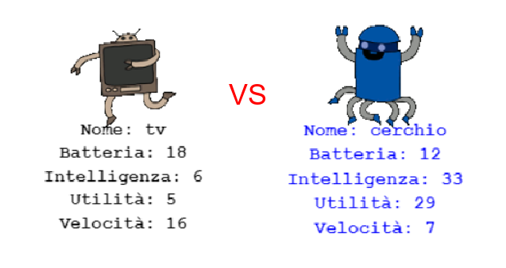

## Introduction

In questo progetto leggerai dei dati da un file per creare delle carte robotiche. A quel punto, potrai giocare a Carte Robotiche con un amico.

  <iframe src="https://trinket.io/embed/python/9ccc368bd5?outputOnly=true&start=result" width="600" height="500" frameborder="0" marginwidth="0" marginheight="0" allowfullscreen>
  </iframe>
  

### Ulteriori informazioni per gli organizzatori di club

Se intendete stampare questo progetto, cliccate su [Versione stampabile](https://projects.raspberrypi.org/en/projects/robo-trumps/print).

## \--- collapse \---

## title: Note per gli organizzatori di club

## Introduzione:

In questo progetto i ragazzi leggeranno dei dati da un file salvandoli in un dizionario, per creare carte da gioco per sfide tra robot. Le carte potranno successivamente essere usate per giocare a Carte Robotiche con un amico.

## Risorse online

**Questo progetto utilizza Python 3.** Consigliamo di utilizzare [trinket](https://trinket.io/) per scrivere in linguaggio Python online. Questo progetto contiene i seguenti Trinket:

* ['Robotrumps' punto di partenza -- jumpto.cc/trumps-go](http://jumpto.cc/trumps-go)

È disponibile anche un trinket con un esempio di soluzione alle sfide:

* [‘Robotrumps’ finito -- trinket.io/python/9ccc368bd5](https://trinket.io/python/9ccc368bd5)

## Risorse offline

Questo progetto può anche essere [completato offline](https://www.codeclubprojects.org/en-GB/resources/python-working-offline/). È possibile accedere alle risorse facendo click sul link "Materiali del progetto" di questo progetto. Questo link contiene una sezione "Risorse del progetto", dove sono raccolte le risorse necessarie ai ragazzi per completare il progetto offline. È bene assicurarsi che tutti i bambini abbiano accesso a una copia di queste risorse. Questa sezione include i seguenti file:

* robotrumps/robotrumps.py
* robotrumps/cards.txt
* Varie immagini .gif di robot

Una versione completa delle sfide di questo progetto è presente anche nella sezione “Risorse per i volontari”, che contiene:

* robotrumps-finished/robotrumps.py
* robotrumps-finished/cards.txt
* Varie immagini .gif di robot

(Tutte le risorse sopra indicate possono essere scaricate anche come file `.zip` di progetto, anche per i volontari.)

## Obiettivi di apprendimento

* Consolidamento: data structures, leggere file e turtle graphic;
* Usare le immagini in turtle graphic;
* Condividere progetti trinket.

Questo progetto include elementi tratti dalle seguenti sezioni del [Raspberry Pi Digital Making Curriculum](http://rpf.io/curriculum):

* [Combinare i costrutti base di un linguaggio di programmazione per risolvere un problema.](https://www.raspberrypi.org/curriculum/programming/builder)

## Sfide

* Aggiungere altri robot - Modificare un file .txt e lavorare con le immagini;
* Aggiungere altre statistiche ai robot - gestire i dati;
* Giocare a Carte Robotiche con un amico.

## Domande frequenti

* **Se è offline, Python non accetta .png come formato di immagini. Sono state preparate delle immagini in formato .gif per lavorare offline.**
* Questo progetto usa sia l'input testuale che le turtle graphic, e si può regolare la quantità di spazio dato ad entrambi nei trinket.
* È necessario cliccare nella finestra di testo del trinket prima di digitare.
* I ragazzi possono usare il pulsante 'Share' nel trinket per ottenere un link al loro progetto. Se possiedono una email possono mandare il link ad un amico, altrimenti possono leggerlo, scriverlo su un pezzo di carta o salvarlo su un file di testo in locale.

\--- /collapse \---

## \--- collapse \---

## title: Materiali del progetto

## Risorse del progetto

* [File .zip con tutte le risorse del progetto](resources/robo-trumps-project-resources.zip)
* [Trinket online contenente le risorse per iniziare 'Carte robotiche'](http://jumpto.cc/trumps-go)
* [robo-trumps/robo-trumps.py](resources/robo-trumps-robo-trumps.py)
* [robo-trumps/cards.txt](resources/robo-trumps-cards.txt)
* [robo-trumps/space.gif](resources/robo-trumps-space.gif)
* [robo-trumps/rainbow.gif](resources/robo-trumps-rainbow.gif)
* [robo-trumps/bird.gif](resources/robo-trumps-bird.gif)
* [robo-trumps/dog.gif](resources/robo-trumps-dog.gif)
* [robo-trumps/jet.gif](resources/robo-trumps-jet.gif)
* [robo-trumps/round.gif](resources/robo-trumps-round.gif)
* [robo-trumps/brains.gif](resources/robo-trumps-brains.gif)
* [robo-trumps/twoheads.gif](resources/robo-trumps-twoheads.gif)
* [robo-trumps/shades.gif](resources/robo-trumps-shades.gif)
* [robo-trumps/hair.gif](resources/robo-trumps-hair.gif)
* [robo-trumps/tv.gif](resources/robo-trumps-tv.gif)
* [robo-trumps/yellow.gif](resources/robo-trumps-yellow.gif)

## Risorse per gli organizzatori di club

* [File .zip con tutte le risorse del progetto](resources/robotrumps-volunteer-resources.zip)
* [Trinket online completato](https://trinket.io/python/9ccc368bd5)
* [robo-trumps-finished/robo-trumps.py](resources/robo-trumps-finished-robo-trumps.py)
* [robo-trumps-finished/cards.txt](resources/robo-trumps-finished-cards.txt)
* [robo-trumps-finished/space.gif](resources/robo-trumps-finished-space.gif)
* [robo-trumps-finished/rainbow.gif](resources/robo-trumps-finished-rainbow.gif)
* [robo-trumps-finished/bird.gif](resources/robo-trumps-finished-bird.gif)
* [robo-trumps-finished/dog.gif](resources/robo-trumps-finished-dog.gif)
* [robo-trumps-finished/jet.gif](resources/robo-trumps-finished-jet.gif)
* [robo-trumps-finished/round.gif](resources/robo-trumps-finished-round.gif)
* [robo-trumps-finished/brains.gif](resources/robo-trumps-finished-brains.gif)
* [robo-trumps-finished/twoheads.gif](resources/robo-trumps-finished-twoheads.gif)
* [robo-trumps-finished/shades.gif](resources/robo-trumps-finished-shades.gif)
* [robo-trumps-finished/hair.gif](resources/robo-trumps-finished-hair.gif)
* [robo-trumps-finished/tv.gif](resources/robo-trumps-finished-tv.gif)
* [robo-trumps-finished/yellow.gif](resources/robo-trumps-finished-yellow.gif)

\--- /collapse \---