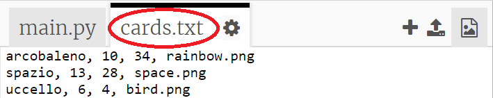
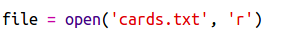
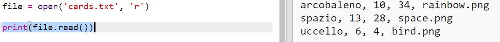
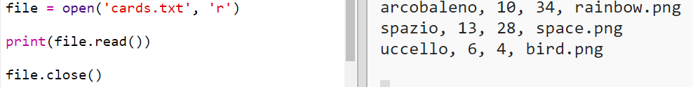
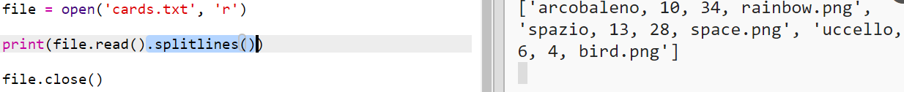
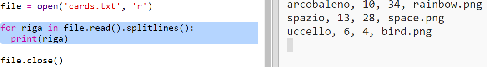
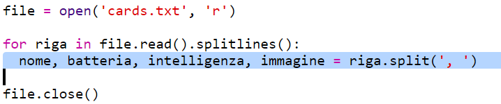
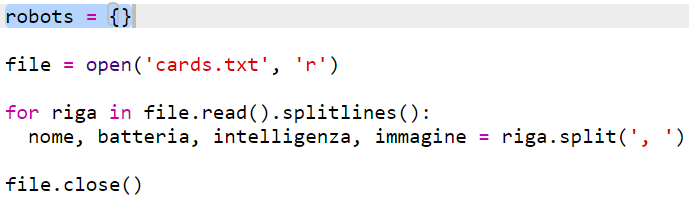
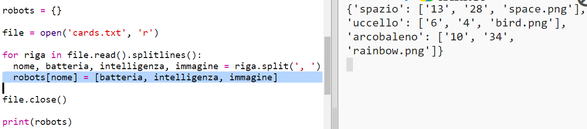

## Leggi i dati robot da un file

Spesso è utile poter leggere informazioni da un file. Puoi ora cambiare i dati in un file senza dover cambiare il tuo codice.

+ Apri questo trinket: <a href="http://jumpto.cc/trumps-go" target="_blank">jumpto.cc/trumps-go</a>.

+ Il tuo progetto d'inizio include un file 'cards.txt' che contiene dati sui robot.

  Clicca su 'cards.txt' per vedere i dati:

  

  Ogni linea ha dati su un robot. Gli oggetti nei dati sono separati da virgole.

  Ogni linea contiene le seguenti informazioni:

  nome, indice d'intelligenza, durata di vita della batteria, nome del file dell'immagine

+ Leggiamo i dati dal file in modo che tu possa usarli.

  Il primo passo è di aprire nel tuo script il file 'cards.txt':

  

+ Ora puoi leggere i dati dal file.

  

+ Quando hai finito, dovresti sempre chiudere un file:

  

+ Questo ci dà il file come una sequenza, dovrai romperla in pezzi di dati individuali.

  Innanzitutto, puoi dividere il file in una lista di linee:

  

  Guarda attentamente l'uscita. Ci sono tre oggetti nella lista, ciascuno è una linea da un file.

+ Ora puoi girare su quelle linee una alla volta.

  

+ Invece di stampare le linee, leggile in variabili:

  

+ Vuoi essere in grado di usare questi dati in un secondo momento per controllare i valori di un particolare robot. Usiamo il nome del robot come chiave di un dizionario.

  Aggiungi un dizionario 'robots':

  

+ Ora aggiungiamo una voce al dizionario per ciascun robot.

  Il nome è la chiave e il valore è una lista di dati per quel robot.

  Aggiungi il codice evidenziato:

  

  Puoi rimuovere 'print robots' quando hai provato il tuo script.
