## Visualizza i dati sullo schermo

Ora puoi mostrare i dati del robot in un modo più interessante.

Mostriamo un carta robotica con un'immagine e i dati sulla sua intelligenza e sulla sua utilità.

Una volta completato questo passaggio, potrai mostrare robot come questo:

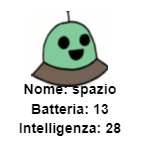

+ Chiedi all'utente quale robot vorrebbe vedere:
    
    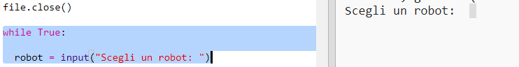

+ Se il robot è nel dizionario, cerca i suoi dati:
    
    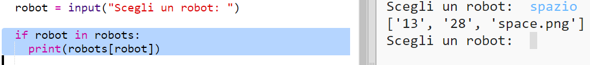
    
    Prova il tuo codice inserendo il nome di un robot.

+ Se il robot non esiste, restituisci un errore:
    
    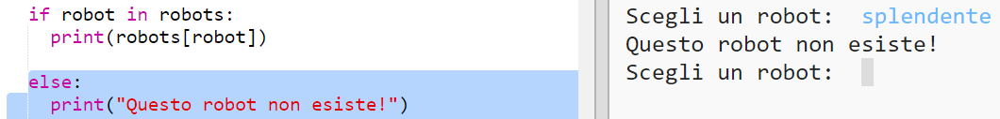
    
    Prova il tuo codice inserendo un nome che non è nel dizionario.

+ Ora utilizzerai il modulo "turtle graphic" di Python per visualizzare i dati dei robot.
    
    Importa la libreria turtle in cima al tuo codice e imposta lo schermo e le proprietà della turtle:
    
    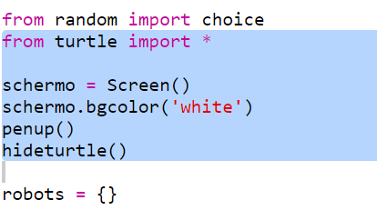

+ Ora aggiungi il codice per usare la turtle per mostrare il nome del robot:
    
    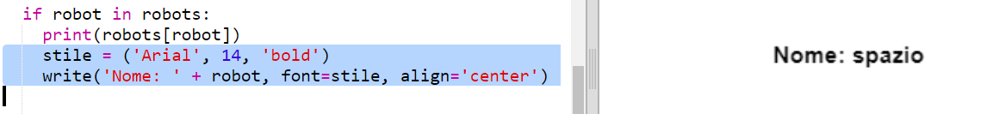

+ Prova a cambiare la variabile `stile` finchè non sei soddisfatto.
    
    Invece di `Arial` puoi provare `Courier`, `Times` o `Verdana`.
    
    Modifica la dimensione del carattere con un numero diverso da `14`.
    
    Puoi cambiare `bold` in `normal` o `italic`.

+ Salva la lista di statistiche del robot in una variabile invece di visualizzarla a schermo:
    
    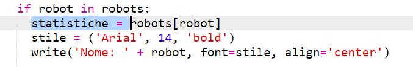

+ Ora puoi accedere alle statistiche del robot come con gli elementi di una lista:
    
    + `statistiche[0]` rappresenta l'intelligenza
    + `statistiche[1]` rappresenta la batteria
    + `statistiche[2]` rappresenta il nome dell'immagine
    
    Aggiungi il codice per mostrare i livelli di intelligenza e batteria:
    
    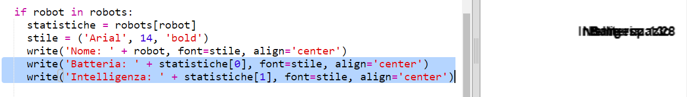

+ Diamine! Le statistiche sono tutte sovrapposte. Dovrai aggiungere del codice per spostarle:
    
    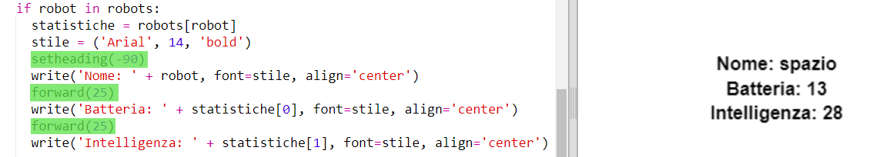

+ Infine, aggiungiamo l'immagine del robot per completare.
    
    Dovrai aggiungere una linea di codice per registrare l'immagine, quando leggi i dati da `cards.txt`:
    
    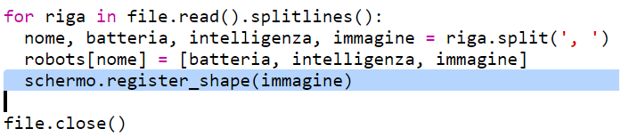

+ E aggiungi il codice per posizionare e mostrare l'immagine:
    
    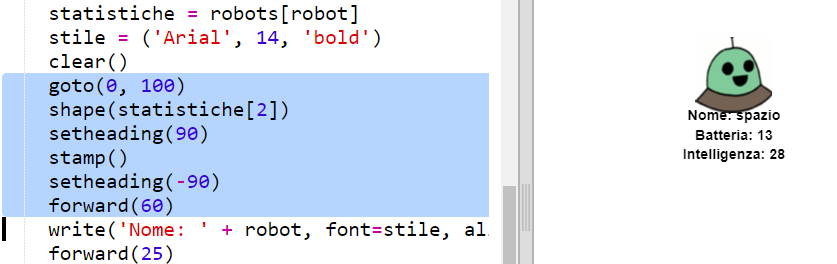

+ Prova il tuo codice inserendo un robot e poi un altro, e vedrai che verranno mostrati uno sull'altro!
    
    Dovrai resettare lo schermo prima di mostrare un robot:
    
    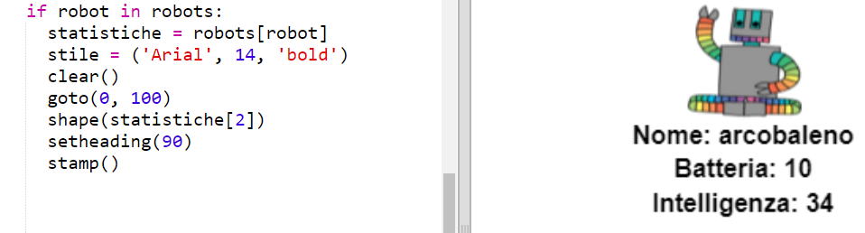