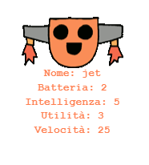

\--- challenge \---

## Sfida: Aggiungi altre statistiche ai robot

Hai in mente altre statistiche da aggiungere ai robot? Potresti aggiungere 'velocità' o 'utilità', oppure usare altre tue idee.

Dovrai:

+ Aggiungere i dati al file per ogni nuova categoria 
+ Aggiungere la nuova categoria al codice che legge i dati dal file
+ Mostra la nuova categoria quando mostri una carta robotica

Potresti anche aggiungere un colore e mostrare le statistiche dei robot nel loro rispettivo colore.

Suggerimento: Usa `color('red')` per colorare il testo di rosso prima di scrivere.

Esempio:

\--- /challenge \---