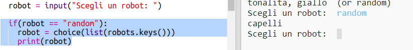

## Visualizza un robot a caso

Aggiungiamo un codice in modo che tu ottenga un robot a caso quando digiti A Caso invece che il nome del robot.

+ Per prima cosa, dovrai importare la funzione di selezione dal modulo a caso:

  

+ Puoi usare 'choice' (scelta) per scegliere un nome a caso per il robot dalla lista di chiavi dal dizionario del robot.

  

