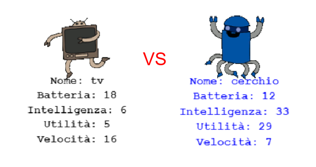

\--- challenge \---

## Sfida: Gioca a Carte Robotiche con un amico

Condividi il tuo progetto con un amico e gioca a Carte Robotiche. Usate entrambi lo stesso progetto, così è equo! Il primo giocatore richiede un robot casuale, per poi scegliere una categoria. Poi, il secondo giocatore richiede un robot casuale, e si controlla chi ha il punteggio più alto per la categoria scelta. Infine, ci si scambia.

Il gioco funziona meglio se giocate entrambi con lo stesso mazzo di carte. Condividi un link al tuo progetto trinket con un amico, in modo da poter usare entrambi lo stesso mazzo.

\--- /challenge \---