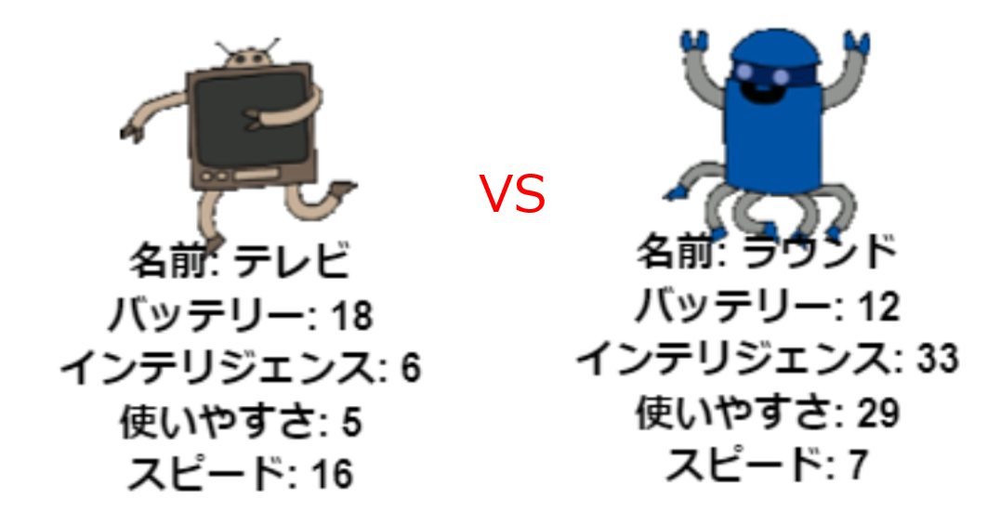

## はじめに

このプロジェクトでは、ファイルからデータを読み込んでロボットトランプカードを作成します。 その後、友達と一緒にロボットトランプをプレイすることができます。

  <iframe src="https://trinket.io/embed/python/e3c4cfb1b0?outputOnly=true&start=result" width="600" height="500" frameborder="0" marginwidth="0" marginheight="0" allowfullscreen>
  </iframe>
  

### クラブリーダーのための追加情報

このプロジェクトを印刷する必要がある場合は、 [印刷用バージョン](https://projects.raspberrypi.org/ja-JP/projects/robo-trumps/print)を使用してください。

--- collapse ---

## title：クラブリーダー・ノート

## はじめに

このプロジェクトでは、学習者はファイルから辞書にデータを読み込んで、ロボットトランプカードを作成します。 このカードを使用して、友達とロボトランプをプレイすることができます。

## オンライン・リソース

**本プロジェクトでは、Python 3を使います。**オンラインでPythonのコードを記述するには、[trinket](https://trinket.io/)の使用をお勧めします。 本プロジェクトには、以下のtrinketが用意されています：

* ['Robotrumps'の出発点 - trinket.io/python/bf8d3530d2](https://trinket.io/python/bf8d3530d2)

また、課題の回答例を含むtrinketもあります。

* ['Robotrumps'が完了しました - trinket.io/python/e3c4cfb1b0](https://trinket.io/python/e3c4cfb1b0)

## オフライン・リソース

このプロジェクトは[オフラインで完成](https://www.codeclubprojects.org/en-GB/resources/python-working-offline/)することが可能です。 “プロジェクト資料”のリンクをクリックすることでこのプロジェクトのリソースにアクセスすることが可能です。 このリンクには、「プロジェクトリソース」セクションがあります。このセクションには、このプロジェクトをオフラインで完了するために必要なリソースが含まれています。 各子供がこれらのリソースのコピーにアクセスできることを確認してください。 このセクションには、次のファイルが含まれています。

* robotrumps/robotrumps.py
* robotrumps/cards.txt
* いくつかのロボット.gif画像

このプロジェクトのチャレンジの完成版は、'ボランティアリソース'セクションでも見つけることができます。そこでは次を含みます:

* robotrumps-finished/robotrumps.py
* robotrumps-finished/cards.txt
* いくつかのロボットの.gif画像

(すべての上記のリソースはプロジェクトとして、ボランティア`.zip` ファイルとしてダウンロードすることも可能。)

## 学習目標

* 統合：データ構造、ファイルおよびタートルグラフィックスからの読み込み、
* タートルグラフィックスで画像を使用する。
* Trinketプロジェクトの共有。

このプロジェクトでは 、[Raspberry Pi デジタル・メイキング・カリキュラム](http://rpf.io/curriculum)の以下の要素をカバーしています。

* [プログラミング構造を組み合わせて問題を解決する。](https://www.raspberrypi.org/curriculum/programming/builder)

## 課題

* ロボットの追加 - .txtファイルの編集と画像の操作
* ロボットに統計を追加する（データの処理）
* 友達とロボットトランプをプレイする

## よくある質問

* **オフラインPythonは.pngイメージでは動作しません。 .gif画像はオフラインで使用するために提供されています。**
* このプロジェクトはテキスト入力とタートルグラフィックの両方を使用することに注意してください。Trinketでそれぞれに与えるスペースの量を調整できます。
* 入力する前に、Trinketテキストウィンドウをクリックする必要があります。
* Trinketの「共有」オプションを使用して、プロジェクトへのリンクを取得できます。 メールにアクセスできる場合は、リンクを友達にメールで送信できます。それ以外の場合は、リンクを読んだり、紙に書き留めたり、ローカルネットワークのテキストファイルに保存したりできます。

--- /collapse ---

--- collapse ---
---
title：プロジェクト資料
---

## プロジェクト資料

* [全プロジェクト・リソースの入った.zipファイル](resources/robo-trumps-project-resources.zip)
* [「ロボットトランプ」のスターターリソースを含むオンラインTrinket](https://trinket.io/python/bf8d3530d2)
* [robo-trumps/robo-trumps.py](resources/robo-trumps-robo-trumps.py)
* [robo-trumps/cards.txt](resources/robo-trumps-cards.txt)
* [robo-trumps/space.gif](resources/robo-trumps-space.gif)
* [robo-trumps/rainbow.gif](resources/robo-trumps-rainbow.gif)
* [robo-trumps/bird.gif](resources/robo-trumps-bird.gif)
* [robo-trumps/dog.gif](resources/robo-trumps-dog.gif)
* [robo-trumps/jet.gif](resources/robo-trumps-jet.gif)
* [robo-trumps/round.gif](resources/robo-trumps-round.gif)
* [robo-trumps/brains.gif](resources/robo-trumps-brains.gif)
* [robo-trumps/twoheads.gif](resources/robo-trumps-twoheads.gif)
* [robo-trumps/shades.gif](resources/robo-trumps-shades.gif)
* [robo-trumps/hair.gif](resources/robo-trumps-hair.gif)
* [robo-trumps/tv.gif](resources/robo-trumps-tv.gif)
* [robo-trumps/yellow.gif](resources/robo-trumps-yellow.gif)

## クラブ・リーダー向けリソース

* [全プロジェクトの完成版リソースの入った.zipファイル](resources/robotrumps-volunteer-resources.zip)
* [完成版プロジェクトのオンラインtrinket](https://trinket.io/python/e3c4cfb1b0)
* [robo-trumps-finished/robo-trumps.py](resources/robo-trumps-finished-robo-trumps.py)
* [robo-trumps-finished/cards.txt](resources/robo-trumps-finished-cards.txt)
* [robo-trumps-finished/space.gif](resources/robo-trumps-finished-space.gif)
* [robo-trumps-finished/rainbow.gif](resources/robo-trumps-finished-rainbow.gif)
* [robo-trumps-finished/bird.gif](resources/robo-trumps-finished-bird.gif)
* [robo-trumps-finished/dog.gif](resources/robo-trumps-finished-dog.gif)
* [robo-trumps-finished/jet.gif](resources/robo-trumps-finished-jet.gif)
* [robo-trumps-finished/round.gif](resources/robo-trumps-finished-round.gif)
* [robo-trumps-finished/brains.gif](resources/robo-trumps-finished-brains.gif)
* [robo-trumps-finished/twoheads.gif](resources/robo-trumps-finished-twoheads.gif)
* [robo-trumps-finished/shades.gif](resources/robo-trumps-finished-shades.gif)
* [robo-trumps-finished/hair.gif](resources/robo-trumps-finished-hair.gif)
* [robo-trumps-finished/tv.gif](resources/robo-trumps-finished-tv.gif)
* [robo-trumps-finished/yellow.gif](resources/robo-trumps-finished-yellow.gif)

--- /collapse ---