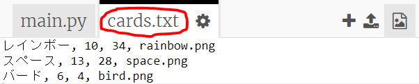
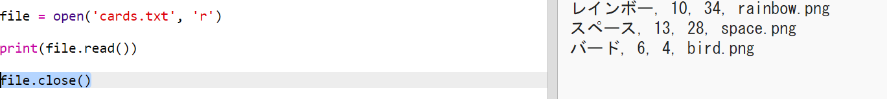
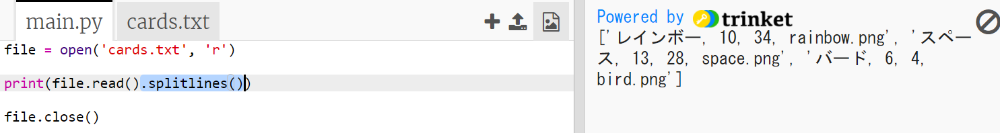
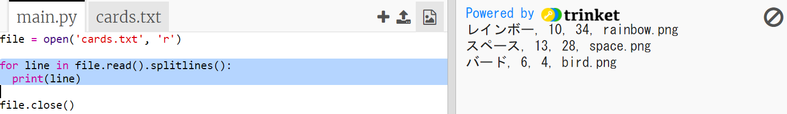
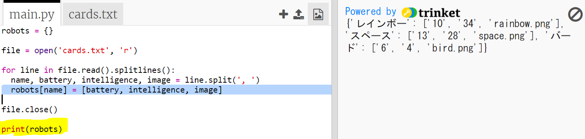

## ファイルからロボットデータを読み込む

多くの場合、ファイルから情報を読み取ることができると便利です。 その後、コードを変更せずに、ファイル内のデータを変更できます。

+ 次のtrinketをひらきます: <a href="https://trinket.io/python/bf8d3530d2" target="_blank">trinket.io/python/bf8d3530d2</a>。

+ スタータープロジェクトには、ロボットに関するデータを含む`cards.txt`ファイルが含まれています。
    
    `cards.txt` をクリックしてデータを表示します：
    
    
    
    各行にはロボットに関するデータがあります。 データ項目はコンマで区切られています。
    
    各行には次の情報が含まれています。
    
    名前、インテリジェンスレーティング、バッテリーの持続時間、画像ファイル名

+ ファイルからデータを読み込み、使用できるようにしましょう。
    
    最初のステップは、あなたのスクリプトで `cards.txt` ファイルを開くことです：
    
    

+ これでファイルからデータを読み取ることができます：
    
    

+ 終了したら、ファイルを閉じる必要があります：
    
    

+ これにより、ファイルが1つの文字列として提供されます。ファイルを個々のデータに分割する必要があります。
    
    まず、ファイルを行のリストに分割します。
    
    
    
    出力を注意深く見てください。 リストには3つの項目があり、それぞれがファイルの行です。

+ 今度は、それらの行を一度に1つずつループすることができます
    
    

+ 行を印刷する代わりに、変数に読み込んでください。
    
    

+ 後でこのデータを使って特定のロボットの値を調べることができます ロボットの名前を辞書のキーとして使用しましょう。
    
    `robots`辞書を追加します：
    
    

+ 次に、各ロボットのロボット辞書にエントリを追加しましょう。
    
    名前はキーであり、値はそのロボットのデータのリストです。
    
    ハイライトされたコードを追加します：
    
    
    
    スクリプトのテストが終われば、`print robots`を削除できます。